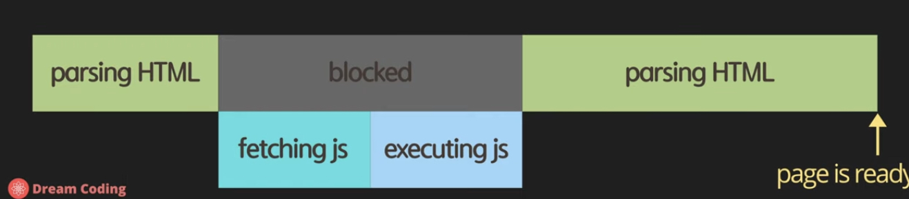
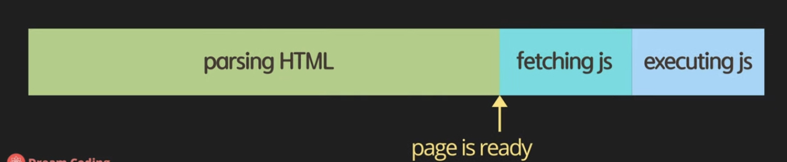
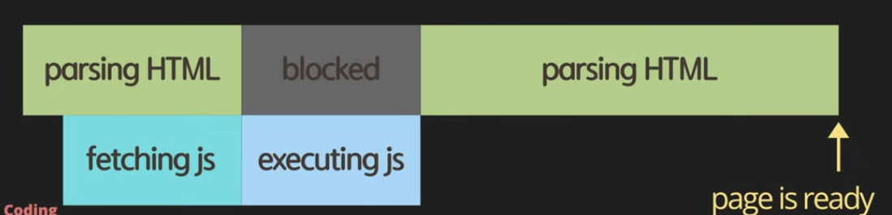
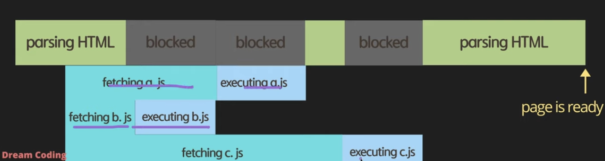
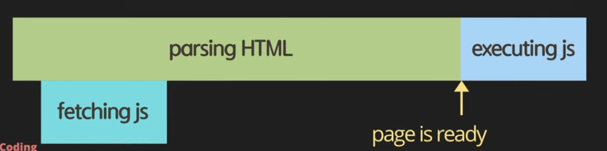
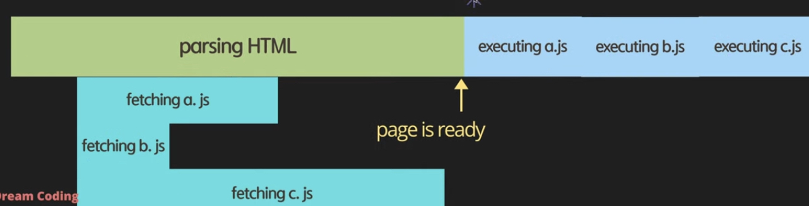

<br>

> HTML에서 JS를 포함할 때 어떻게 포함하는 것이 더 효율적일까?

### 방법 1 - head 태그 안에 넣기 

```html
<!DOCTYPE html>
<html lang="en">
    <head>
        <meta charset="UTF-8" />
        <meta name="viewport" content="width=device-width, initial-scale=1.0" />
        <title>Document</title>
        <script src="main.js"></script>
    </head>
    <body></body>
</html>
```



- 먼저 사용자가 HTML 파일을 다운로드 받았을 때 브라우저가 한 줄 한 줄씩 분석한다. 이걸 CSS와 병합해서 DOM 요소로 변환한다.
- HTML 태그를 한 줄 씩 파싱하다가 `<script>` 태그가 보이면 JS 를 다운로드 받아야 되네라고 이해하게 된다.
그래서 HTML 파싱하는 것을 잠시 멈추고 필요한 JS 를 서버에서 다운로드 받아서 실행한 다음에 HTML 파싱하는 부분으로 넘어간다.
- 이 방법의 단점 : JS파일이 너무 크고 인터넷이 느리면 사용자가 웹사이트를 보는 데까지 많은 시간이 소요된다.
그래서 `script` 를 `head` 에 포함하는 것은 좋은 방법이 아니다.

<br>

### 방법 2 - body 태그 안, 최하단에 넣기 

```html
<!DOCTYPE html>
<html lang="en">
    <head>
        <meta charset="UTF-8" />
        <meta name="viewport" content="width=device-width, initial-scale=1.0" />
        <title>Document</title>
    </head>
    <body>
        <div></div>
        <script src="main.js"></script>
    </body>
</html>
```



- `body` 내, 가장 하단에 `script` 를 추가하는 방법
- 브라우저가 HTML을 파싱하여 페이지가 전부 준비가 된 다음에 JS 파일을 다운로드 받고 실행한다.
- 사용자 입장에서는 JS를 받기 전에도 페이지의 컨텐츠를 볼 수 있게 된다.
- 이 방법의 단점 : 기본 HTML을 빨리 볼 수 있는 장점은 있지만 만약에 이 웹사이트가 JS에 의존적일 경우(의미 있는 화면을 보기 위해서 서버에서 데이터를 받아와야 한다던지.. 등) JS가 다운로드되고 실행될 때까지 사용자가 기다려야 한다.

<br>

### 방법 3 - head 태그 안에 async 속성과 함께 넣기 

```html
<!DOCTYPE html>
<html lang="en">
    <head>
        <meta charset="UTF-8" />
        <meta name="viewport" content="width=device-width, initial-scale=1.0" />
        <title>Document</title>
        <script async src="main.js"></script>
    </head>
    <body>
        <div></div>
    </body>
</html>
```



- `head` 안에 `script` 태그를 넣되, `async` 라는 속성값을 이용한다
- 브라우저가 HTML을 다운로드 받아서 파싱을 하다가 병렬로 JS 파일을 다운로드 받는다. JS 다운로드가 완료되면 HTML 파싱을 멈추고 JS 를 실행한다. 실행을 다 하고나서 나머지 HTML을 파싱한다.
- 장점 : `body` 끝에 사용하는 것 보다는 JS fetching이 HTML 파싱하는 동안 병렬로 일어나기 때문에 다운로드 받는 시간을 절약할 수 있다.
- 단점 : HTML이 전부 파싱되기도 전에 JS가 실행되기 때문에, 만약 JS 파일에서 DOM 요소를 조작한다면 조작하려고 하는 시점에 DOM 요소가 아직 존재하지 않을 수 있다.
- 단점 2 : HTML 파싱하다가 중간에 JS 를 실행하기 위해 언제든 멈출 수 있기 때문에 사용자가 페이지를 보는데 시간이 걸릴 수 있다.
- 여러개의 JS 파일을 `async` 로 다운로드 받게 되면 작성한 순서대로 script 가 실행되는 것이 아니라 먼저 다운로드 된 것이 먼저 실행된다. 만약 JS 파일끼리 의존적이라 순서가 중요하다면 이러한 방식은 위험할 수 있다.

    


<br>

### 방법 4 - head 태그 안에 defer 속성과 함께 넣기 (추천!)

```html
<!DOCTYPE html>
<html lang="en">
    <head>
        <meta charset="UTF-8" />
        <meta name="viewport" content="width=device-width, initial-scale=1.0" />
        <title>Document</title>
        <script defer src="main.js"></script>
    </head>
    <body>
        <div></div>
    </body>
</html>
```



- `head` 안에 `script` 태그를 넣되, `defer` 라는 속성값을 이용한다
- HTML을 파싱하다가 JS를 다운로드 받자고 명령만 해놓고 나머지 HTML을 끝까지 파싱하게 된다.
파싱이 전부 끝나고 나면 다운로드 되어진 JS 를 실행한다.
- 여러 개의 JS 파일을 `defer`로 다운로드 받게 되면 다운로드가 먼저 끝나는 것과 상관 없이 실행은 작성한 script 순서대로 실행된다.

    
    
<br>

### Reference
- [https://www.youtube.com/watch?v=tJieVCgGzhs](https://www.youtube.com/watch?v=tJieVCgGzhs)