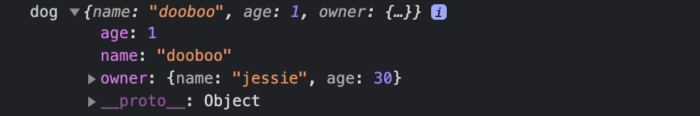
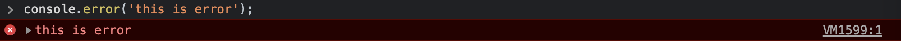
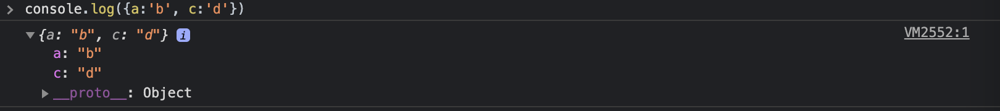
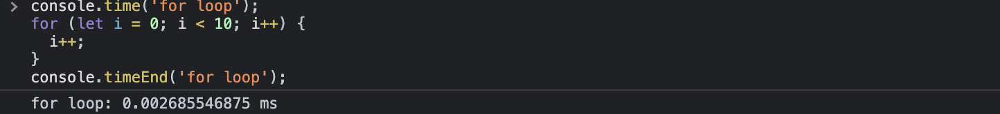
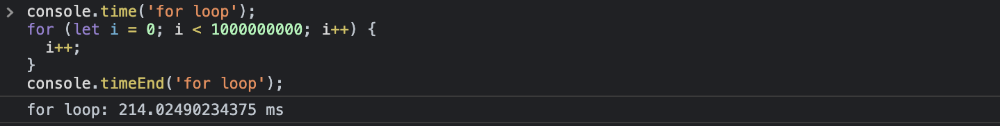
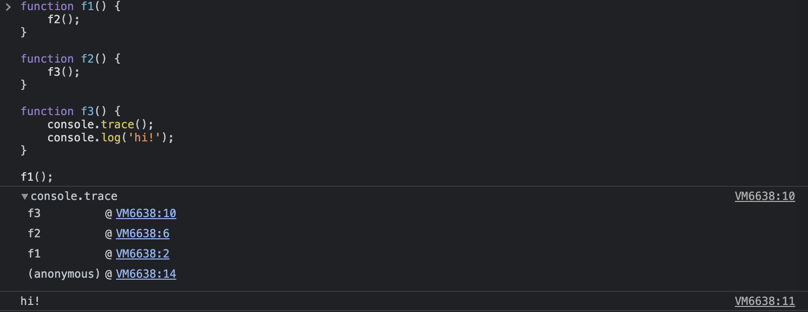

> 브라우저에서 제공하는 Console API는 심각성이나 기능에 따른 다양한 유용한 함수들이 많이 제공된다.

## console.log

- 개발 단계에서 데이터를 출력해보고 싶을 때 사용
- 배포할 때는 정말 필요한 경우가 아니라면 삭제해서 배포하는 것이 좋다.
- 무언가 출력한다는 것은 성능에 영향을 줄 수 있기 때문에 빈번하게 로그를 남겨놓는 것은 좋지 않다.
- example

    ```jsx
    const dog = { name: 'dooboo', age: 1, owner: { name: 'jessie', age: 30 } };
    console.log('dog', dog);
    ```

    - log(...data: any[]) 배열 형태로 여러가지를 출력할 수 있다.
    - 출력 결과

        
        
<br />

## console.info

- 특정한 정보를 출력할 때 사용
- 배포할 때는 정말 필요한 경우가 아니라면 삭제해서 배포하는 것이 좋다.
        
<br />

## console.warn

- 심각한 에러는 아니고 경고 단계에서 사용
- `console.warn`을 사용하면 브라우저 콘솔창에 아래와 같이 출력된다.

    
                
<br />

## console.error

- 심각한 에러일 때 사용 (예상하지 못한 에러, 시스템 에러)
- `console.error`을 사용하면 브라우저 콘솔창에 아래와 같이 출력된다.

    
                
<br />

## 심각성에 따라서 다른 Console API를 사용해야 하는 이유

`log`나 `info`는 배포할 때 출력이 되지 않도록 설정할 수 있는데 `warn`, `error`에만 특별한 동작을 하도록 만들 수 있기 때문에 레벨에 따라서 정확한 함수를 사용하는 것이 중요하다
                
<br />

## console.assert

- 조건이 `false`일 때만 출력이 된다.
- 내가 원하는 특정한 경우에만 출력이 되도록 사용하고 싶을 때 `assert`를 사용할 수 있다.
- example

    ```jsx
    console.assert(2 === 3, 'not same!'); // Assertion failed: not same!
    console.assert(2 === 2, 'same!'); // 출력 X
    ```

<br />

## console.table

- `console.log`를 이용해서 object를 출력할 수도 있지만 `console.table`을 사용하면 object를 가독성 있게 확인할 수 있다.
- example - console.log를 이용해서 object를 출력

    
        
- example - console.table을 이용해서 object를 출력

    
                
<br />

## console.time

- 내가 작성한 코드를 수행하는데 얼마나 오랜 시간이 걸렸는지 측정할 떄 사용
- `console.time` 부터 `console.timeEnd`를 호출할 때까지 총 걸린 시간을 출력해준다. 단, 각각 `time`과 `timeEnd`에는 동일한 레이블을 사용해야 한다.
- example 1

    
        
- example 2

    
                
<br />

## console.count

- 함수가 몇 번째 호출되었는지 확인하고 싶을 때 `console.count` 를 사용할 수 있다.
- 함수 호출 count를 초기화하고 싶을 때는 `console.countReset`을 사용하면 초기화된다. 단, `console.count`에서 사용했던 동일한 레이블을 사용해야 한다. 예를 들어, `console.count('foo 함수 실행');` 을 초기화 하고 싶다면 `console.countReset('foo 함수 실행');` 으로 `foo 함수 실행`과 같이 동일한 레이블을 사용해야 한다.
- example

    
                
<br />

## console.trace

- 함수가 어디에서 호출되었는 지 알 수 있다!
- EventListener나 비동기적으로 수행되는 함수가 있다면 어디에서 누가 호출했는지 알기 힘든데, 이 때 `trace`를 유용하게 사용할 수 있다.
- example

    ```jsx
    function f1() {
    	f2();
    }

    function f2() {
    	f3();
    }

    function f3() {
    	console.trace();
    	console.log('hi!');
    }

    f1();
    ```

    
        
    - `f3` 이라는 함수는 `f2`에서 호출되었고, `f2` 함수는 `f1`에서 호출되었다는 것이 확인 된다.
                
<br />

## Reference
- [콘솔 로그 제대로 쓰고 있을까?](https://www.youtube.com/watch?v=KxsVV5jbJe4)
- [https://developer.mozilla.org/ko/docs/Web/API/Console](https://developer.mozilla.org/ko/docs/Web/API/Console)
