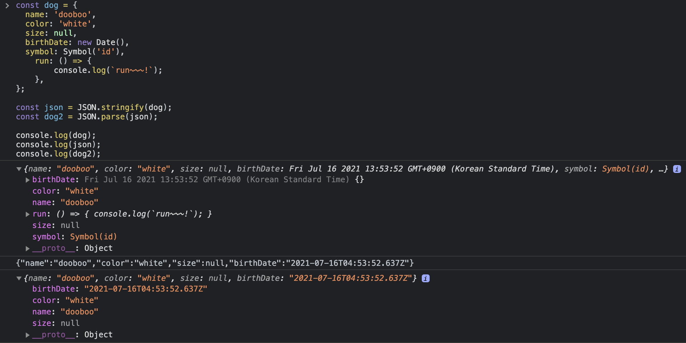

> 웹 브라우저와 같은 Client가 어떻게 Server와 통신할 수 있는지 정의한 것이 HTTP(Hypertext Transfer Protocol)이다.

### Client와 Server가 통신하는 방법

- HTTP를 이용해서 서버에 데이터를 요청해서 받아올 수 있는 방법으로 `AJAX(Asynchronous JavaScript And XML)`가 있다.
- `AJAX`는 웹페이지에서 동적으로 서버와 데이터를 주고 받을 수 있는 기술을 의미한다.
- 대표적으로는 `XHR(XMLHttpRequest)`라는 오브젝트가 있다. 브라우저 API에서 제공하는 오브젝트 중에 하나로, 이걸 이용하면 간단하게 서버에게 데이터를 요청하고 받아올 수 있다.
- 최근 브라우저 API에 추가된 `fetch() API` 를 이용하면 간편하게 데이터를 주고받을 수 있다.
- 그런데 이 `fetch() API`는 IE에서 지원하지 않는다.

<br />

### XML

- HTML과 같은 마크업 언어 중에 하나
- 태그를 이용해서 데이터를 나타낸다.
- `AJAX`와 `XHR`의 각각 `X`가 `XML`의 약자이지만 서버와 데이터를 주고받을 때 `XML` 뿐만 아니라 다양한 파일 포맷을 이용할 수 있다. 주로 `JSON`을 많이 사용한다.
- `XML`을 이용하면 불필요한 태그들이 너무 많이 들어가서 파일 사이즈도 커지고 가독성도 좋지 않기 때문에 요즘에는 많이 사용되지 않는다.

<br />

### JSON (JavaScript Object Notation)

- `Object` 처럼 `{ key: value }` 형태로 이루어져 있다.
- 브라우저 뿐만 아니라 모바일과 서버가 데이터를 주고 받을 때 사용할 수 있다.
- 서버와 통신하지 않아도 `Object`를 파일 시스템에 저장할 때 사용할 수 있다.
- 데이터를 주고받을 때 사용할 수 있는 가장 간단한 파일 포맷
- 텍스트를 기반으로 해 가볍다
- 가독성이 좋다
- 프로그래밍 언어나 플랫폼에 상관없이 쓸 수 있다. (C, C#, Java, Python, PHP, Kotlin, Go, .... )

<br />

### Object → JSON 변환

> JSON.stringify(obj)

- example 1

    ```jsx
    const json = JSON.stringify(true);
    console.log(typeof json, json); // string, true
    ```

<br />

- example 2

    ```jsx
    const json = JSON.stringify(['apple', 'banana']);
    console.log(typeof json, json); // string ["apple","banana"]
    ```

<br />

- example 3

    ```jsx
    const dog = {
      name: 'dooboo',
      color: 'white',
      size: null,
      birthDate: new Date(),
      symbol: Symbol('id'),
    	run: () => {
    		console.log(`run~~~!`);
    	},
    };

    const json = JSON.stringify(dog);
    console.log(typeof json, json); // string {"name":"dooboo","color":"white","size":null,"birthDate":"2021-07-16T01:36:04.415Z"}
    ```

    - `run`이라는 함수는 json에 포함되지 않는다.
    - 함수는 object에 있는 데이터가 아니기 때문이다.
    - javascript 자체에 들어있는 `symbol` 데이터도 json에 포함되지 않는다.

<br />

- example 4 - 두 번째 인자(replacer) 사용하기 - 배열

    ```jsx
    const json = JSON.stringify(dog, ['name']);
    console.log(typeof json, json); // string {"name":"dooboo"}
    ```

    - 두 번째 인자로 함수 형태나 배열 형태로 전달할 수 있다.
    - 위 코드에서는 `name`만 json으로 뽑게 된다.

<br />

- example 5 - 두 번째 인자(replacer) 사용하기 - 콜백 함수

    ```jsx
    const json = JSON.stringify(dog, (key, value) => {
    	return key === 'name' ? 'jessie' : value;
    });
    console.log(typeof json, json); // string {"name":"jessie","color":"white","size":null,"birthDate":"2021-07-16T01:36:04.415Z"}
    ```

    - 모든 `key`와 `value`들이 콜백 함수에 전달된다.
    - json으로 만들어낼 때 조금 더 세밀하게 통제하고 싶으면 콜백 함수를 사용할 수 있다.

<br />

### JSON → Object 변환

> JSON.parse(json)

```jsx
const dog = {
  name: 'dooboo',
  color: 'white',
  size: null,
  birthDate: new Date(),
  symbol: Symbol('id'),
    run: () => {
      console.log(`run~~~!`);
    },
};

const json = JSON.stringify(dog);
const dog2 = JSON.parse(json);

console.log(dog);
console.log(json);
console.log(dog2);
```

- 실행 결과

    

<br />

- 메소드 호출

    ```jsx
    dog.run(); // run~~~!
    dog2.run(); // Uncaught TypeError: dog2.run is not a function
    ```

    - `dog` 객체는 `run` 메소드를 가지고 있어서 `dog.run()` 는 잘 호출이 된다.
    - `dog2`는 string으로 만들어진 json으로부터 다시 object로 만들었기 때문에 함수는 포함되지 않아서 `dog2.run()`과 같이 호출하면 에러가 발생한다.`dog` object를 json으로 변환할 때는 함수가 포함되지 않기 때문이다.

<br />

- Date

    ```jsx
    dog.birthDate.getDate(); // 16
    dog2.birthDate.getDate(); // Uncaught TypeError: dog2.birthDate.getDate is not a function
    ```

    - `dog`객체는 `birthDate`라는 속성을 가지고 있는데 이것은 `Date` 형태라서 `getDate`라는 API 를 사용할 수 있다.
    - `dog`을 json으로 만들고 이를 다시 object로 만든 `dog2`의 `birthDate.getDate()`를 하면 에러가 발생한다. 여기에서 `birthDate`는 string이기 때문이다.
    - Date 형태를 그대로 쓰고싶을 때는 parse 를 할 때 아래와 같이 콜백함수를 이용할 수 있다.

        ```jsx
        const dog3 = JSON.parse(json, (key, value) => {
        	return key === 'birthDate' ? new Date(value) : value;
        });

        dog3.birthDate.getDate(); // 16
        ```

        - `birthDate`를 새로운 Date Object로 만들기 위해 콜백 함수를 이용했다.

<br />

### 유용한 사이트 공유
- [JSON Diff](http://jsondiff.com)
- [JSON Beautifier](https://jsonbeautifier.org)
- [JSON Parser](https://jsonparser.org)
- [JSON Validator](https://tools.learningcontainer.com/json-validator)
        
<br />

### Reference
- [JSON 개념 정리와 활용방법](https://www.youtube.com/watch?v=FN_D4Ihs3LE)
