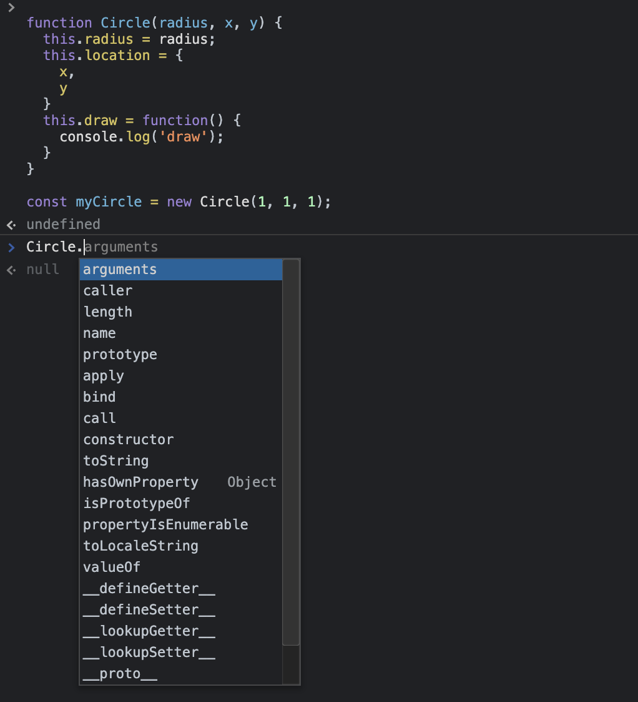

## 0. Table of Contents

1. [What is OOP](/JavaScript/oop-1/) 
1. **[Objects](/JavaScript/oop-2/)** ***👉 Current Page***
3. Prototypes *(TBD)*
4. Prototypical Inheritance *(TBD)*
5. ES6 Classes *(TBD)*
6. ES6 Modules *(TBD)*

<br />

## 1. Creating Objects

```js
const circle = {}; // using object literal syntax
```
- 중괄호 (`{}`)를 객체 리터럴 구문이라고 한다.

<br />

```js
const circle = {
  radius: 1,
  location: {
    x: 1,
    y: 1
  },
  draw: function() {
    console.log('draw');
  }
};
```
- 객체는 key-value 쌍을 가진다.
- value 값으로 객체나 함수도 가질 수 있다.
- 객체의 속성으로 존재하는 함수는 메소드라고 부른다.
- 위의 `circle` 객체는 Properties로 `radius`와 `location`가 있고 Methods로 `draw`가 있다.

<br />

```js
circle.draw(); // 출력 결과 : draw
```
- Dot (`.`)으로 객체의 Properties 및 Methods에 접근할 수 있다.

<br />

## 2. Factories and Constructors

#### 2-1. Factories
- Bad Example
    ```js
    const circle1 = {
      radius: 1,
      location: {
        x: 1,
        y: 1
      },
      draw: function() {
        console.log('draw');
      }
    };
    
    const circle2 = {
      radius: 2,
      location: {
        x: 2,
        y: 2
      },
      draw: function() {
        console.log('draw');
      }
    };
    ```

    - 서로 다른 객체 내의 각 draw 메소드는 동일한 역할을 한다. 이 때 draw 메소드를 객체를 생성할 때마다 넣게 되면 불필요한 코드 중복이 발생한다.
factory나 constructor function을 이용하여 해결할 수 있다. 아래의 Good Example을 보자.

<br />

- Good Example - Using Factory

    ```js
    // Factory Function
    function createCircle(radius, x, y) {
      return {
        radius,
        location: {
          x,
          y
        },
        draw: function() {
          console.log('draw');
        }
      };
    }
    
    const circle1 = createCircle(1, 1, 1);
    const circle2 = createCircle(2, 2, 2);
    ```
    - `createCircle`이라는 함수를 생성했다. 이 함수는 객체를 반환하고 객체 내의 속성은 함수의 매개변수로 받아오도록 처리한다.
    - 이와 같은 방식을 Factory Function 을 이용한 방식이라고 한다.
    - Factory Function을 이용하면 객체를 생성할 때마다 객체 내부의 메소드를 매번 다시 정의하지 않아도 된다.
    
<br />

#### 2-2. Constructors
```js
// Constructor Function
function Circle(radius, x, y) {
  this.radius = radius;
  this.location = {
    x,
    y
  }
  this.draw = function() {
    console.log('draw');
  }
}

const myCircle = new Circle(1, 1, 1);
console.log(myCircle.radius); // 1
```
- Constructor Function의 네이밍 컨벤션으로 첫 글자를 대문자로 한다.
- Factory Function이 Object를 return하는 방식이였다면, Constructor Function은 this 키워드를 사용하는 방식이다.
- Constructor Function을 이용해서 객체를 생성할 때는 new 키워드를 사용한다.
- new 키워드는 빈 객체(`{}`)를 생성하도록 하고 함수 내 `this`는 이 빈 객체를 가리키게 된다.
- `this`가 이 빈 객체를 가리키고 이 빈 객체에 `this.radius` 와 같은 방식으로 Properties와 Methods를 추가하는 것이다.
- new 키워드를 사용하면 Constructor Function이 자동으로 `return this`를 하게 된다.
- 따라서 Properties와 Methods가 추가된 이 객체가 반환되고 반환된 객체를 `myCircle`에 할당하고 있기 때문에 `myCircle.radius` 을 출력하면 정상적으로 `1`이 출력된다.
- 만약 new 키워드를 사용하지 않고 `const badCircle = Circle(2, 2, 2);`와 같이 작성했다면 함수 내 `this`는 `badCircle`가 아닌 `Window`(브라우저 기준)가 된다.
- constructor 속성
    ```js
    console.log(myCircle.constructor); // f Circle(...) {...}
    console.log(Circle.constructor); // f Object() {...}
    ``` 
    - 모든 Object 는 constructor 속성에 접근할 수 있다. 위의 코드에서 `myCircle.constructor`는 `Circle` 함수를 가리킨다.
    - 그리고 `Circle.constructor`는 자바스크립트에 내장된 함수인 `Object` 함수이다.

<br />

### 2-3. Functions are Objects
```js
function Circle(radius, x, y) {
  this.radius = radius;
  this.location = {
    x,
    y
  }
  this.draw = function() {
    console.log('draw');
  }
}

const myCircle = new Circle(1, 1, 1);
```

- 위의 `Circle` 함수는 사실 하나의 Object다.
- `Circle.` 을 입력하면 접근할 수 있는 멤버(methods, properties)들이 자동 추천 목록으로 뜬다.
(ex. apply, arguments, bind, call, caller, length, name, prototype, toString, ...)
    
- JavaScript의 모든 객체는 Constructor 속성이 있고 이 Constructor는 해당 객체를 생성할 때 사용되는 함수를 가리킨다.
- 함수는 객체라고 했기 때문에 위의 `Circle` 함수도 하나의 객체이므로 Constructor 속성을 가지고, 이 Constructor는 이 `Circle`을 생성할 때 사용된 함수를 가리킨다.  
따라서 `Circle.constructor` 을 출력해보면 `ƒ Function() { [native code] }` (자바스크립트에 내장된 Constructor인 function)가 출력된다.
- `function Circle() {...}` 와 같이 함수를 선언할 때, 자바스크립트 엔진은 function constructor을 이용해서 객체를 생성하게 된다.

<br />

## 3. Primitives and Reference Types


<br />

## 4. Working with Properties

<br />

## 5. Private Properties

<br />

## 6. Getters and Setters

<br />

## 7. Exercise - Stop Watch

<br />

## Reference

- [Udemy - Object-oriented Programming in JavaScript](https://www.udemy.com/course/javascript-object-oriented-programming/)