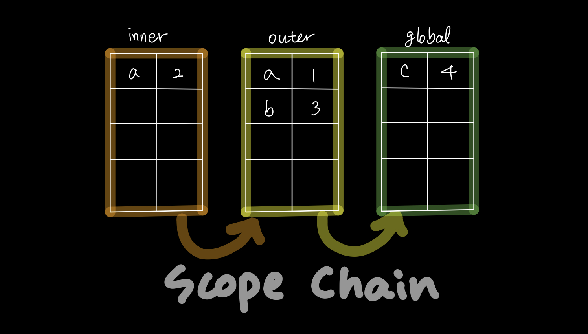

# 1. 스코프 체인

```js
function outer() {
  var a = 1;
  console.log(a); // 1
}

outer();
```

- `console.log(a)`에서 `a`에 어떤 값이 들어있는지 찾을 때 들여다 보는 곳이 스코프다.
- 여기서 이 스코프는 `outer` 함수에 속해있다.
- 자바스크립트(ES5)는 함수 단위로 스코프가 생성된다.

<br />

```js
var c = 4;

function outer() {
  var a = 1;
  var b = 3;

  function inner() {
    var a = 2;
    console.log(a); // 2
    console.log(b); // 3
    console.log(c); // 4
  }
	
  inner();
}

outer();
```

- `console.log(a)`에서 `a`의 값을 찾으려고 할 때 들여다보는 곳이 스코프이고 스코프는 함수 단위이다.
이 때, `inner` 함수 스코프, `outer` 함수 스코프, `global` 스코프가 존재하는데 `inner` 스코프 안에서 먼저 `a`가 존재하는지 찾는다.
- 마찬가지로 `console.log(b)`에서 `b`의 값을 `inner` 스코프 안에서 먼저 찾는다. `inner` 스코프에는 `b`가 없기 때문에 그 다음 `outer` 스코프에 `b`가 있는지 찾아본다.
`inner` 함수가 생성된 곳이 `outer` 함수 범위 안에 있기 때문이다.
- 마찬가지로 `console.log(c)`에서 `c`의 값을 `inner` 스코프 안에서 먼저 찾는다. `inner` 스코프에는 `c`가 없기 때문에 그 다음 `outer` 스코프에 `c`가 있는지 찾아본다. `outer` 스코프에도 `c`가 없기 때문에 global 스코프에서 찾는다.
`inner` 함수가 생성된 곳이 `outer` 함수 범위 안에 있고, `outer` 함수가 생성된 곳이 global 범위 안에 있기 때문이다. **이런식으로 스코프끼리 연결된 것이 바로 스코프 체인이다.**



<br />

# 2. 클로저

```js
var c = 4;

function outer() {
  var a = 1;
  var b = 3;

  return function inner() {
    var a = 2;
    console.log(b); // 3
  }
}

var someFunc = outer();
someFunc();
```

- `outer` 함수는 `inner` 함수를 return 하고 있고 `someFunc`에는 `outer` 함수의 실행결과 값이 들어가기 때문에 `inner` 함수가 들어가게 된다.
- 그런데, `var someFunc = outer();` 에서 outer 함수를 호출해서 실행이 완료되면 outer 함수 내 지역 변수들은 사라질 것 같지만 사라지지 않는다. 몇몇 프로그래밍 언어에서는 함수 안의 지역 변수들은 그 함수가 처리되는 동안에만 존재하지만 자바스크립트는 함수를 리턴하고 리턴하는 함수가 클로저를 형성하기 때문이다.
- 클로저는 함수와 함수가 선언된 어휘적 환경의 조합이다. 이 환경은 클로저가 생성된 시점의 유효 범위 내에 있는 모든 지역 변수로 구성된다.
- `someFunc`는 `outer`이 실행될 때 생성된 `inner` 함수의 인스턴스에 대한 참조다. `inner`의 인스턴스는 변수 `b`가 있는 어휘적 환경에 대한 참조를 유지한다. 이런 이유로 `someFunc`가 호출될 때 `b`는 사용할 수 있는 상태로 남게된다.
- 즉, 원래는 함수 내부에 선언한 변수는 함수가 끝나면 사라지지만, 클로저가 스코프 체인을 계속 들고 있으므로 `outer` 함수 내부의 변수를 참조할 수 있게 된다.

<br />

# Reference

- [클로저 - JavaScript | MDN](https://developer.mozilla.org/ko/docs/Web/JavaScript/Closures)
- [자바스크립트 클로저? 간단히 핵심만 파악하기](https://www.youtube.com/watch?v=MbYShFxp-j0)