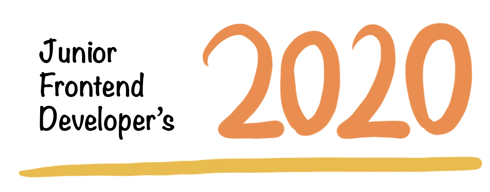
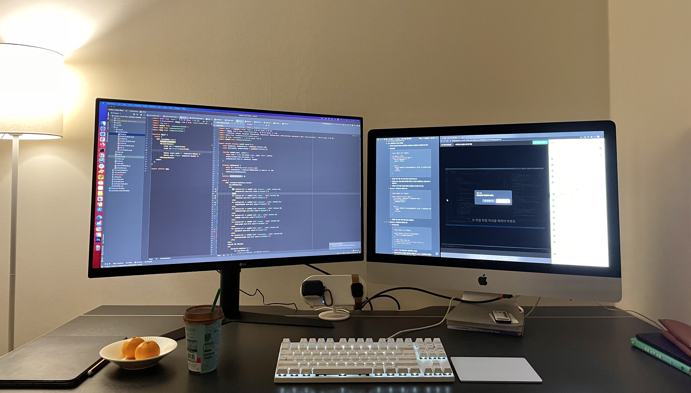

2018년 8월, Web Frontend 신입 개발자로 현 회사에 입사해 3년차 개발자가 되었지만 회고록은 처음 작성해본다.

어떻게 작성해야 좋은 회고가 될 수 있을지에 대한 고민을 해봤다.  
그런데 회고는 결국 지난 날들을 돌아보고 잘 마무리해서 앞으로 더 많이 성장하기 위함이기 때문에 그냥 솔직하게 1년의 일기 같은 회고록을 작성해보기로 했다.

나의 2020년을 돌아보자.

 

## 재택 근무
2020년 1월 말, 스페인 여행을 끝내고 돌아오면서 친구들에게 '공항 도착하면 마스크 꼭 착용하라' 는 연락을 받았다.  
이 때 코로나 바이러스가 퍼지기 시작했고 우리 회사도 2월 말에 첫 재택 근무를 시행했다.

 

> 재택 근무 효율?

재택 근무를 하면서 업무 효율성이 더 높아졌다.
- Jira 활용도 높아짐
- 집중이 잘 됨
- 출퇴근 시간이 없어서 더 좋은 컨디션

개인적으로는 사무실보다 방해 요소가 적어서 집중이 잘 된다는 점이 가장 큰 장점인 것 같다. ~~(첫 재택 근무를 시행했던 한 달 간 처리한 Jira 티켓 개수가 개발팀에서 가장 많아서 선물을 받기도 했다.)~~  
그리고 Windows 보다 macOS 운영체제를 선호하는데 사무실에서는 Windows를 사용하는 반면 집에서는 macOS를 사용할 수 있어서 좋다..🍎  

11월 말부터 코로나 상황이 심각해져서 다시 재택 근무를 시행 중이다. 너무 집 안에만 있어서 답답한 점은 있지만 재택 근무 자체의 업무 효율성은 확실히 높은 것 같다. **코로나는 싫지만 재택 근무는 좋다.**

 

## Code Quality와 성능 최적화
솔직히 2018 ~ 2019년은 기능 구현하기에 바빴었다. 성능에 대한 고민이나 유지 보수 측면에서 어떻게 짜는 게 더 좋은지와 같은 고민은 못하고 빨리 기능을 구현하는 것에 급급했다.
JavaScript 변수 키워드 `let`, `const` 도 구분해서 쓰지 않고 `let` 만 사용하기도 했다.  

그러다가 올해 여름에 작년에 진행했던 프로젝트를 유지 보수하게 되었는데 코드를 보고 충격을 받았다. 너무 부끄러워서 아무에게도 보여주고 싶지 않을 정도였다.
덕분에 기술 부채를 정리하면서 코드 품질과 성능 최적화에 대한 고민과 공부를 많이 하게 되었고 해당 프로젝트의 **렌더링 성능도 두 배 이상 향상시켰다.**

최근에는 TDD를 공부하고 있는데 테스트 주도 개발이 리팩토링 하기 좋은 코드를 만들어내는 것 같다.  
...공부할 것이 정말 많다.

 

## 오픈 소스 운영
처음으로 [NPM](https://www.npmjs.com/) 에 Module을 Publish 해봤다.

1. [vue-button-animation](https://www.npmjs.com/package/vue-button-animation)
2. [vue-qr-print](https://www.npmjs.com/package/vue-qr-print)

NPM Module 배포는 그동안 계속 하고 싶었지만 계획만 하고 미루고 미뤘던 일이었다.  
그러다가 회사 내 여러 프로젝트에서 공통으로 사용하는 부분을 모듈화 시켜봐야겠다는 생각이 들어서 실행에 옮기게 되었다.  

해당 모듈을 회사 프로젝트에 install 시켜서 사용하면서 모듈의 불편한 점을 개선해 나가고 있다. 더 많은 사람들이 편리하게 사용할 수 있도록 2021년에는 더 develop 시켜야지.

모듈 배포는 기능 구현 말고도 Document, Demo Examples 등 신경 쓸 게 생각보다 많았다. 내 모듈의 사용법을 자세하게 알려주기 위한 고민을 많이 했던 것 같다.
그리고 개인적으로 Document를 영어로 작성하면서 영어 공부에 대한 욕구가 더 불타올랐다🔥  

 

## Interactive Web

- [jess2.github.io/interactive-web/](jess2.github.io/interactive-web/)

두 달 전 즈음, 인터랙티브 웹의 매력에 빠졌다.  

Apple 사이트의 멋진 인터랙션을 보면서 감탄만 하다가 [Inflearn](https://www.inflearn.com/) 에 인터랙티브 웹 강의를 신청해 들었는데 순수 JavaScript 로 멋진 화면을 만들어내는 것이 재밌었다.

2021년에는 Interactive한 나만의 포트폴리오 사이트를 만들어 보고 싶다.

 

## 성장에 대한 고민과 욕심
아직 너무나 많이 부족하고 공부할 것이 정말 많다는 걸 알고 있다. 그래서 개발을 잘 하고 싶은 욕심에 열심히 해야겠다는 생각도 들지만 한 편으로는 벌써 뒤처져 있는 것은 아닐까 라는 생각에 불안감도 든다.

개발은 재밌다.  
그러나 재미가 아니라 더 잘 하고싶다는 욕심과 실행력이 나를 성장으로 이끈다고 생각한다. 부지런해지자.

5월 즈음, 1일 1커밋에 도전했다가 한달여 만에 실패했다. 2021년에는 꾸준한 부지런함에 도전해본다.

#### 2021년에 (더) 잘 해내고 싶은 것들
1. React / TypeScript
2. TDD 와 좋은 설계
3. Interactive Web 포트폴리오
4. NPM Module Develop
5. 개발 블로그 포스팅
6. English

 