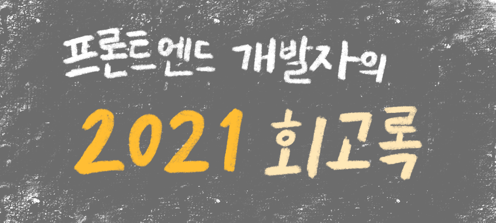
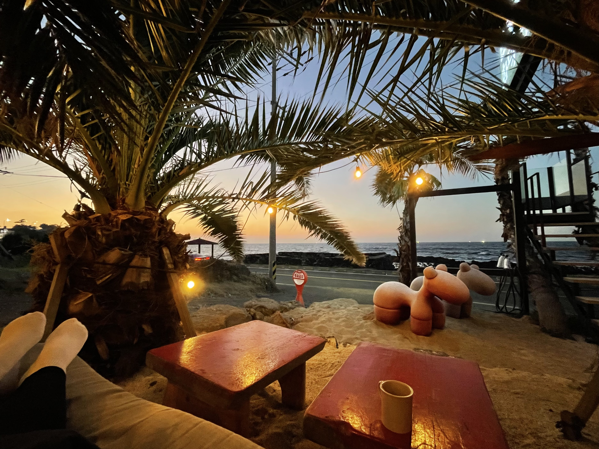
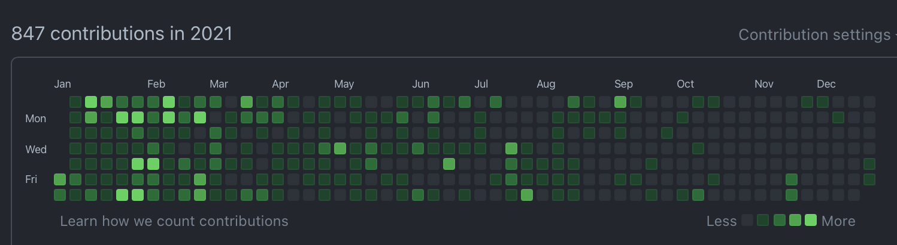

현재 날짜 기준으로 경력 만 3년이 조금 지난 4년차 웹 프론트엔드 개발자의 지난 2021년 회고록을 작성해본다.

개인적으로는 3~4년차가 가장 애매한 시기 중 하나인 것 같다.

이제 더 이상 신입도 아니고 그렇다고 시니어도 아니다. 개인적으로 느끼기에는 아직 많이 부족하고 공부할 게 너무 많은데 회사에는 뭔가를 보여줘야 할 것 같은 부담감이 몰려오는 시기라고 해야 되나…

이런 애매한 실력과 짬(?)으로 고군분투 했던 지난 2021년을 되돌아 보도록 한다.

# Index

- 프론트엔드 개발 프로젝트 리더
- 나의 첫 퇴사 그리고 Refresh
- 네이버로의 이직
- 꾸준한 부지런함
- 2022년에 (더) 잘 해내고 싶은 것들

 

# 프론트엔드 개발 프로젝트 리더

2020년까지는 프로젝트를 주로 혼자 맡아 1인 개발을 했었다. 그래서 개발을 하다가 막히는 부분은 사수에게 Help!를 쳤지만 코드리뷰와 같은 과정 없이 혼자 `Pull Request`를 보내고 `Approve` 하고 `Merge` 하는 방식으로 진행했었다.

그러다가 2021년 초에 본인을 포함한 3명의 프론트엔드 개발자들과 진행할 프로젝트의 개발 리더 역할을 맡게 되었다. 첫 협업이자 리더이기도 했고 기존에는 `Vue.js`, `JavaScript` 기술 조합으로 개발을 해왔다면 그동안 현업에서 사용해보고 싶었던 `React`, `TypeScript` 조합으로 개발을 하게 되어서 많이 설렜다.

게다가 해당 프로젝트에 평소에 흥미 있었던 `Interactive Web` 개발 요소가 들어가 있었다. 다뤄보고 싶었던 기술을 현업 프로젝트에 도입할 수 있다니 정말 운이 좋았다. (사실 개인적으로 공부를 하더라도 현업 프로젝트에서 다뤄보는 것 만큼 실력을 빠르게 향상시킬 수 있는 건 없다고 생각한다.)

## 경험한 것들

- Next.js, React, TypeScript, styled-components 기술 사용
- Interactive Web (Scroll Interaction, Animation)
- Semantic Markup 및 반응형 UI 개발 (Mobile, Tablet, Desktop)
- 오프라인 / 온라인 코드리뷰
- Custom Hooks를 사용한 코드 재사용성 향상
- Server-Side-Rendering을 통한 SEO(검색 엔진 최적화) 경험

## 멋진 걸 만들면 기분이 조크든요😌

그동안 Apple 사이트와 같은 인터랙티브 웹을 보면서 나도 이런 멋진 사이트를 만들고 싶다는 생각을 했었다. 그런 와중에 드디어 인터랙티브 웹 요소(Scroll 위치에 따라 보여지는 화면을 계산하는 인터랙션 기능)가 들어간 [프로젝트](https://maxst.com/)를 진행하게 된 것이다.

~~역시 나는 **눈에 보이는 멋진 무언가**를 만드는 것에 흥분된다.~~

## 특히 좋았던 코드 리뷰 경험

협업을 하면 가장 해보고 싶었던 **코드 리뷰 정책**을 팀원들과 협의하여 도입했다.

처음에는 일주일에 2회 정도 시간을 잡고 **오프라인 코드리뷰**로 진행했었다. 오프라인 코드리뷰는 말로 본인의 코드를 설명하고 그 자리에서 바로 피드백 받는 형태로 진행했다. 아무래도 직접 말로 주고 받기 때문에 서로의 코드나 설명이 더 잘 이해된다는 장점이 있었다. 그런데 매일 진행하는 것이 아니다 보니 **지난 날의 내가 왜 이렇게 코드를 짰는지** 잊어버리는 경우가 종종 발생했다. 

그래서 도입한 것이 **`PR` 단위 온라인 코드리뷰**였다. `PR`을 보낼 때마다 한 명 이상이 `Approve`를 해야 `Merge`가 되는 방식으로 정책을 도입하고 Bitbucket에 해당 기능을 설정했다.

#### 코드 리뷰 정책을 도입함으로써 특히 좋았던 점들

- 여러 명이 개발을 한 프로젝트를 개발하더라도 일관된 코딩 스타일을 유지할 수 있다.
- 본인이 개발하지 않은 부분의 코드도 어느 정도 이해하고 있기 때문에 수정이나 대응이 가능하다.
- 더 좋은 코드를 작성하기 위해 함께 고민할 수 있어 개인 성장에도 많은 도움이 된다.
- *(파트장님이 말씀해주신 내용)* 코드 리뷰를 통해 팀원들의 개발 실력이 상향 평준화 된다.

 

# 나의 첫 퇴사 그리고 Refresh

첫 회사에서 재직 기간 3년을 조금 넘기고 퇴사를 하게 되었다.

퇴사를 결심했던 가장 큰 이유는 **더 큰 기업에서 더 많은 사용자들이 사용하는 서비스를 개발**해보고 싶었기 때문이다. 사용자와 밀접하게 닿아있는 프론트엔드 개발이 좋았던 나는 더 많은 사용자가 사용하는 서비스를 개발할 때 더 보람을 느끼고 더욱 더 동기 부여가 될 것이라는 생각이 들었다.

그리고 스타트업을 경험해봤으니 다음에는 대기업을 경험해보고 싶다는 생각도 간절했다.

그렇게 첫 회사에서의 첫 퇴사를 하게 되었다.

개발자에게 첫 회사는 꽤 중요한데, 나는 나의 첫 회사를 다니면서 좋은 사수를 포함한 좋은 동료들을 만나 행운이었다는 생각을 아직까지도 하고 있다.

회사를 다녔던 약 3년간 개인적으로도 정말 많이 성장했고 또 함께 커가는 회사에 애정이 많았는데 이렇게 애정이 클 수 있었던 가장 큰 이유는 단연 좋은 동료들 때문이었다고 생각한다.

동료들과 정이 정말 많이 들었어서 퇴사 날에는 아쉬운 마음에 ~~눈물을 참지 못했다.~~

## Refresh in Jeju

3년간 쉬지 않고 달렸기 때문에 이직을 하게되면 꼭 한 달 정도 쉬리라는 다짐을 했기 때문에 9월 말에 현 회사의 합격 소식을 듣자마자 전 회사에 퇴사 의사를 밝혔었다. 그 후, 인수인계 기간을 갖고 11월 초에 퇴사하게 되었다.

쉬는 기간 중 2주는 제주에 머물렀다. 2주간 외부의 자극과 감정들을 멀리하고 [자문자답](https://smartstore.naver.com/hooh74com/products/4876506576?NaPm=ct%3Dkxx3jn1s%7Cci%3D0Aa0003AsH5vQnd1Zv0C%7Ctr%3Dpla%7Chk%3D5f65bbfcd5d59e7f9fa7213aa7876fbc8d613ee7) 책을 채워가면서 지난 날을 되돌아보고 생각을 정리하는 리프레시 기간을 가졌다.

 

# 네이버로의 이직

네이버 **8월 월간 영입 공고**에 지원해서 `서류 - 코딩테스트 - 세 번의 면접`을 거쳐 최종 합격했다.

## 서류

서류는 그동안 했던 프로젝트에서 경험한 것들과 고민했던 것들을 잘 녹여내려고 했다.

## 코딩테스트

코딩테스트는 경력 개발자 대상이라 그런지 스크리닝 정도의 어렵지 않은 문제들로 출제 되어서 제한 시간 중 약 1시간 정도가 남았었다. [Leetcode](https://leetcode.com/problemset/all/) 와 같은 알고리즘 문제 풀이 사이트에서 평소에 꾸준히 풀려고 노력 했었던 게 도움이 되었던 것 같다. ([문제 풀이 Repository](https://github.com/Jess2/algorithm-solutions-javascript))

## 세 번의 면접

처음에는 기본에 대한 것 위주로 질문을 받고 꼬리물기 형태로 더욱 더 Deep한 질문을 받았다. 면접 시간 내내 질문의 깊이에 놀랐고 **내가 평소에 이렇게 깊이있게 생각하지 못했구나**라는 깨달음도 얻었다.

간절한 마음에 긴장을 정말 많이 했지만 면접관 분들이 편안한 분위기로 이끌어주셔서 정말 감사했다. 대답을 잘 못하는 부분은 힌트를 주시면서 내가 답을 찾아가는 과정을 지켜봐 주셨다.

그리고 개인적으로 신기했던 것은 대학생 때 참여했던 컨퍼런스에 발표자로 나와주셨던 분이 면접관으로 들어와주셨다. 심지어 해당 컨퍼런스 세션 내용 듣고 정리한 걸 개인 블로그에 포스팅도 했었다. 같은 조직이 아니라서 아쉽지만 언젠가 다시 뵙고 인사 드리고 싶다.

## 후기

이직 준비를 시작하고 난 후, 원하는 회사로의 이직이 한 번에 바로 뚝딱 되지는 않았다.  
꽤 지치는 과정이었지만 목표가 명확했기 때문에 계속 부족한 부분을 채워가며 준비하고 도전했다.

> 마냥 맑은 날이면 세상에 온통 사막이라고.   
> 비도 오고 눈도 오고 해야 땅에서 풀도 나고 이런 맛난 귤도 나지.  
> \- 드라마 <스타트업>

감사하게도 현 조직에서 부족한 나를 긍정적으로 평가해주셔서 최종 합격하게 되었다.  
앞으로 더 성장하는 개발자, 개발 잘하는 개발자가 되고 싶다.

 

# 꾸준한 부지런함

[2020년 회고록](https://jess2.xyz/essay/review-2020/)을 작성할 때 2021년에는 꾸준한 부지런함에 도전해보기로 했었다. 개발 블로그 포스팅, 토이 프로젝트, 오프라인 모각코 등을 하면서 **꾸준한 부지런함**이라는 목표 달성에 가까워지는 듯 했지만 2021년 하반기에는 면접 준비와 리프레시를 핑계로 소홀히 했다.

그래서 열심히 하는 다른 개발자분들로부터 자극 받기 위해 [랜선 모각코](https://yian.tistory.com/8) 에 들어갔다. 각자 개인적으로 공부한 내용을 간단히 공유하는 방식으로 진행되어 큰 부담 없이 성장 욕구를 일깨워준다.

 

# 2022년에 (더) 잘 해내고 싶은 것들

- 개인 성장에 더 욕심 내기
- 안주하지 말되 무리하지 말기
- 좋은 코드, 좋은 설계 : 좋은 코드를 고민하는 것에 시간을 아까워하지 말기
- 개발 블로그 포스팅 : 기록하고 정리하고 공유하기
- English : OPIc 도즈언!
