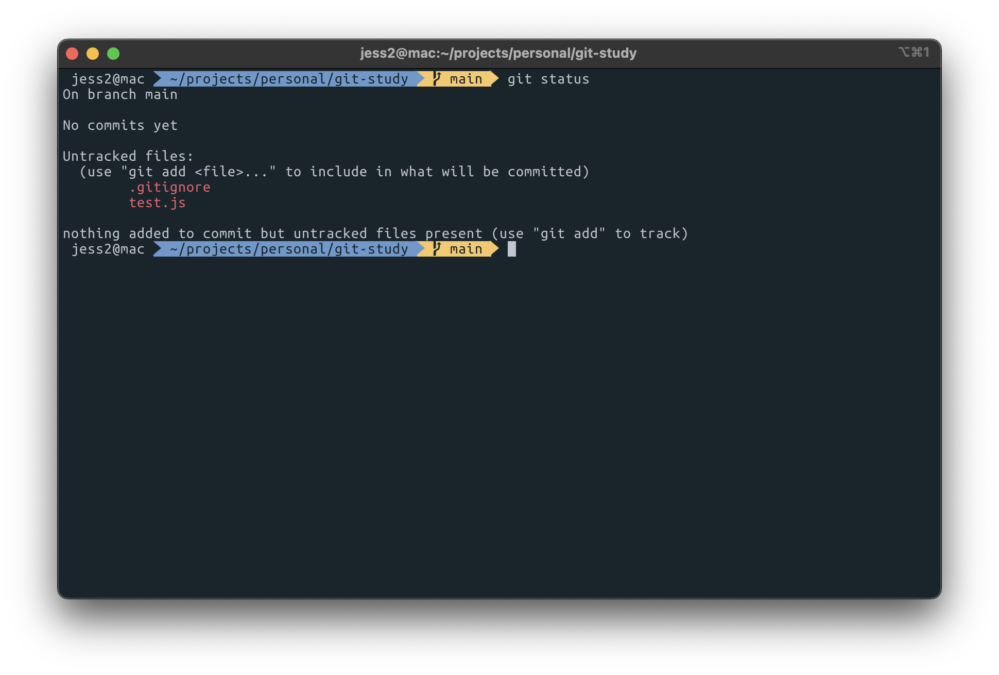
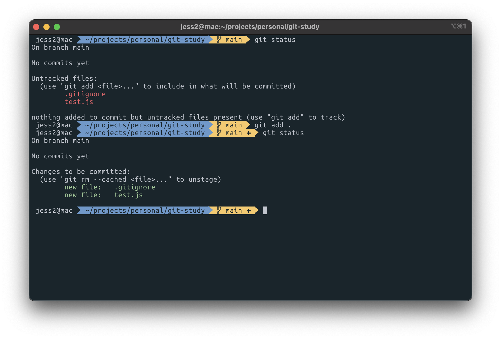
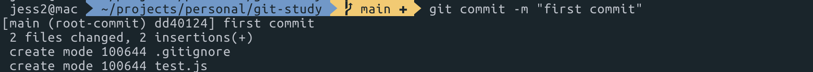
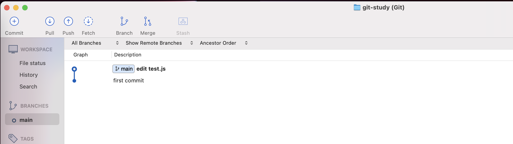
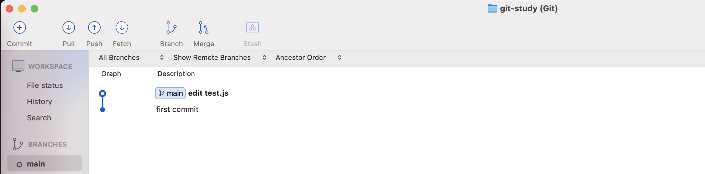

# 0. Index

1. Git 시작하기
2. 시간 여행하기
3. 차원 넘나들기
4. GitHub
5. Git 심화
6. 커밋
7. 취소와 되돌리기
8. 태그
9. Branch
10. 분석과 디버깅
11. Git의 추가 기능들
12. GitHub 활용

# 1. Git 시작하기

### 1-1. Git이란?

- VCS(Version Control System) 중 하나
- 버전 컨트롤 시스템. 프로그램의 버전 관리를 위한 툴
- 버전을 관리한다는 것은 프로그램의 시간과 차원을 관리한다는 것
    - 개발자들이 프로그래밍을 하면서 필요에 따라 시간 여행을 하고 여러 차원을 넘나들 수 있게 해준다.

### 1-2. 설치와 세팅

- Git 설치
    - macOS를 사용한다면 Git이 기본적으로 설치가 되어 있는데, 최신 버전으로 설치가 되어 있는지 확인하자.
    - Git 버전 확인하는 방법
        
        ```bash
        git --version
        ```
        
        1. Terminal에서 위의 명령어 입력
        2. 위 명령어 입력으로 출력되는 Git 버전과 [https://git-scm.com/](https://git-scm.com/) 접속해서 Latest source Release로 나오는 버전과 동일한지 확인
        3. 버전이 동일하지 않다면 이 사이트에서 Download for Mac 버튼을 클릭
        4. Homebrew 설치 후 Terminal에 `brew install git` 명령어 입력
        5. Terminal 종료 후 재실행
- SourceTree 설치
    - [https://www.sourcetreeapp.com/](https://www.sourcetreeapp.com/) 에서 설치할 수 있다.
    - SourceTree란, Git을 GUI(그래픽 사용자 인터페이스)로 다룰 수 있도록 해주는 프로그램이다.
    - 비슷한 것으로 GitHub Desktop이라는 프로그램도 있는데, 전세계적으로 SourceTree가 많이 사용되고 제공하는 기능도 많다.
- iTerms2 설치
    - [https://iterm2.com/](https://iterm2.com/) 에서 설치할 수 있다.
    - macOS에는 기본 Terminal 앱이 설치되어 있는데 일반적으로는 iTerms2 앱을 설치해서 기본 Terminal 앱 대신 사용한다.
    - oh-my-zsh 와 같은 걸 이용해서 테마를 설정할 수 있다.
    

### 1-3. CLI vs GUI

- Git을 사용하는 두 가지 방법 CLI와 GUI
- CLI
    - Command Line Interface, 명령 줄 인터페이스
    - 명령어를 입력해서 사용하는 방식
- GUI
    - Graphical User Interface, 그래픽 사용자 인터페이스
    - 일반인 사용자들이 쓰기 편하도록 그래픽 요소를 활용한 인터페이스
- CLI와 GUI 중 어떤 걸 사용하는 것이 좋은가?
    - Git에서 뭔가를 실행하기 위한 어떤 명령들을 사용할 때는 CLI를 사용 (Terminal)
    - 프로젝트의 상태를 Git 상에서 (시각적으로) 자세히 살펴봐야할 때는 GUI를 사용 (SourceTree)
    

### 1-4. Git 설정 & 프로젝트 관리 시작하기

- Git 최초 설정
    - Git 전역으로 사용자 이름과 이메일 주소를 설정
        
        ```bash
        git config --global user.name Jess2
        git config --global user.email jess2.developer@gmail.com
        ```
        
    - 잘 설정 되었는지 확인
        
        ```bash
        git config --global user.name
        git config --global user.email
        ```
        
    - (프로젝트 별로 사용자 이름과 이메일 주소를 다르게 설정하고 싶다면 `--global` 대신 `--local` 을 입력해주면 된다)
    - 기본 브랜치 변경
        
        ```bash
        git config --global init.defaultBranch main
        ```
        
        - Git 기본 브랜치명이 `master` 로 되어있었는데 `main`으로 변경하도록 권장되고 있음
- 프로젝트 관리 시작하기
    1. 새 프로젝트(폴더) 생성하기
    2. **이 프로젝트를 Git으로 관리한다!** 라는 뜻의 아래의 명령어 입력
        
        ```bash
        git init
        ```
        
        - 명령어를 입력하고 나면 해당 프로젝트 폴더 안에 숨김 폴더로 `.git` 폴더가 생성됨
        - Finder를 열어 프로젝트 폴더 안에서 `command + shift + .` 을 입력하면 숨김 파일/폴더를 볼 수 있음
        - `.git` 폴더를 지우면 Git 관리 내역이 삭제되니 주의!
    3. 프로젝트 폴더 안에 아무 파일을 생성
    4. 이 프로젝트의 현재 상황을 Git의 관점에서 알려줘! 라는 뜻의 아래의 명령어 입력
        
        ```bash
        git status
        ```
        
        - 위 명령어는 현재 폴더의 상황을 Git의 관점에서 알려준다.
        - 새로운 파일이 생성되었으나 Git이 해당 파일을 관리하고 있지 않으니, 관리하게 하려면 `git add` 명령어를 입력하라는 내용이 출력된다.
    

### 1-5. .gitignore

- Git에게 맡기지 않을 것들은 .gitignore (git + ignore = git 무시하다) 파일에 작성해주면 된다.
- Git의 관리에서 특정 파일/폴더를 배제해야 하는 경우
    - 포함할 필요가 없을 때
        - 자동으로 생성 또는 다운로드 되는 파일들 (빌드 결과물, 라이브러리)
    - 포함하지 말아야 할 때
        - 보안상 민감한 정보를 담은 파일
- .gitignore 사용하기
    1. 프로젝트의 루트 경로에 .gitignore 라는 이름으로 파일을 생성한다.
    2. Git의 관리에서 배제할 파일이나 폴더의 이름을 작성한다.
        - 특정 파일이나 폴더를 배제할 때는 파일명, 폴더명을 그대로 적어준다. `ex) test.js`
        - 프로젝트의 **루트 경로**에 있는 파일/폴더로 한정하고 싶다면 `/` 를 붙여준다. `ex) /test.js`
        - 특정 확장자의 파일을 무시 `ex) *.js`
        - `.js` 확장자지만 무시하지 않을 파일 `ex) !not_ignore_this.js`
        - 특정 폴더 **바로 하위**에 있는 걸 무시 `ex) logs/test.js` , `ex) logs/*.js`
        - 특정 폴더 **하위**에 있는 걸 무시 `ex) logs/**/test.js`

# 2. 시간 여행하기

### 2-1. `git add` : Git이 관리하도록 하기

- 프로젝트 내 새로운 파일을 만들고 `git status` 명령어를 입력하면 `untracked files` 즉, Git이 추적하지 않는 파일이라는 문구가 출력된다.

  

- 하나의 특정 파일을 Git이 관리하도록 (추적하도록) 하기 위한 명령어

    ```bash
    git add test.js
    ```

- `.gitignore`에 명시된 파일을 제외한 모든 파일을 Git이 관리하도록 하는 명령어

    ```bash
    git add .
    ```

- 이렇게 `git add` 명령어로 Git이 관리하도록 설정해주고 `git status` 를 입력하면 `Changes to be committed` (커밋할 준비가 되었다는 뜻)이라는 문구가 출력된다.

  


### 2-2. `git commit` : 변화의 이력(버전)을 기록하기

- 커밋이란, Git에서 관리하는 새로운 이력(버전)을 만든다는 것이다.
- 커밋 메세지 작성하기

    ```bash
    git commit -m "first commit"
    ```

  

- 커밋을 하면 소스트리에서도 확인할 수 있고 `git log` 명령어로도 커밋 내역을 확인할 수 있다.

  

- 파일의 내용을 수정한 후, 커밋을 하면 새로운 이력(버전)이 생성된 것을 확인할 수 있다.

    ```bash
    git commit -m "edit test.js"
    ```

  
