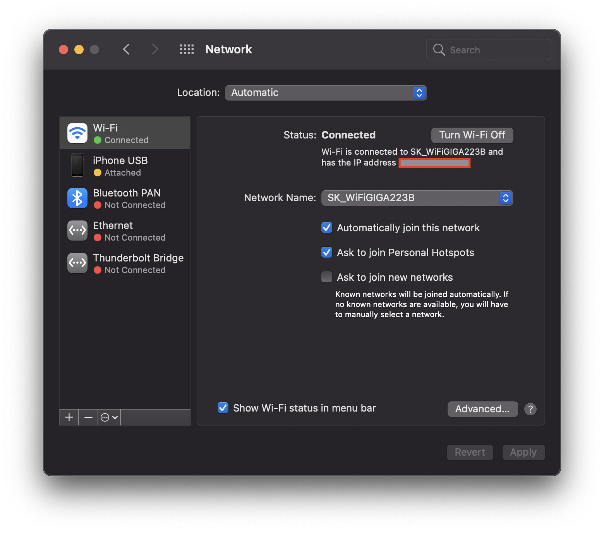
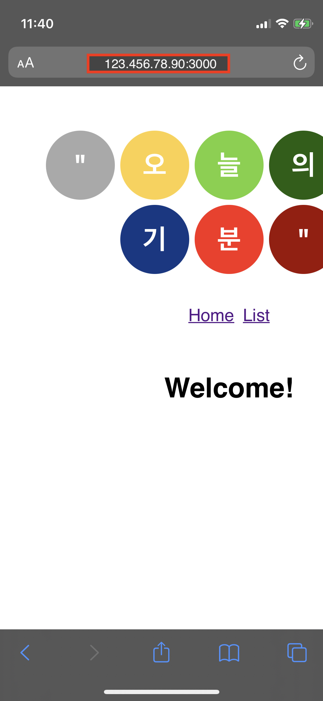
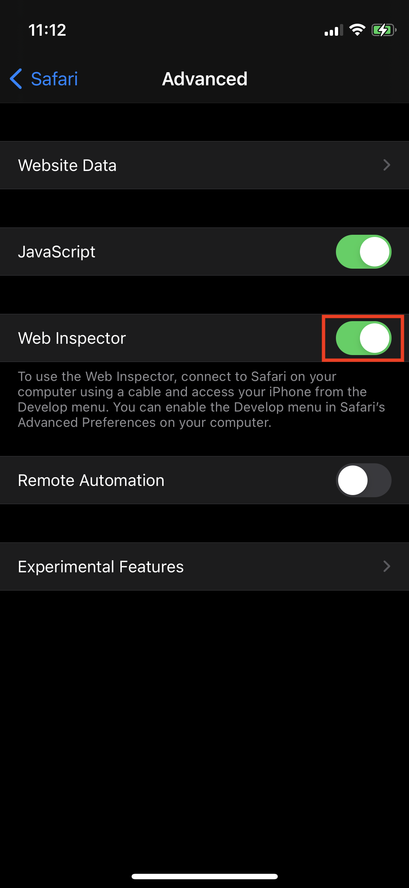
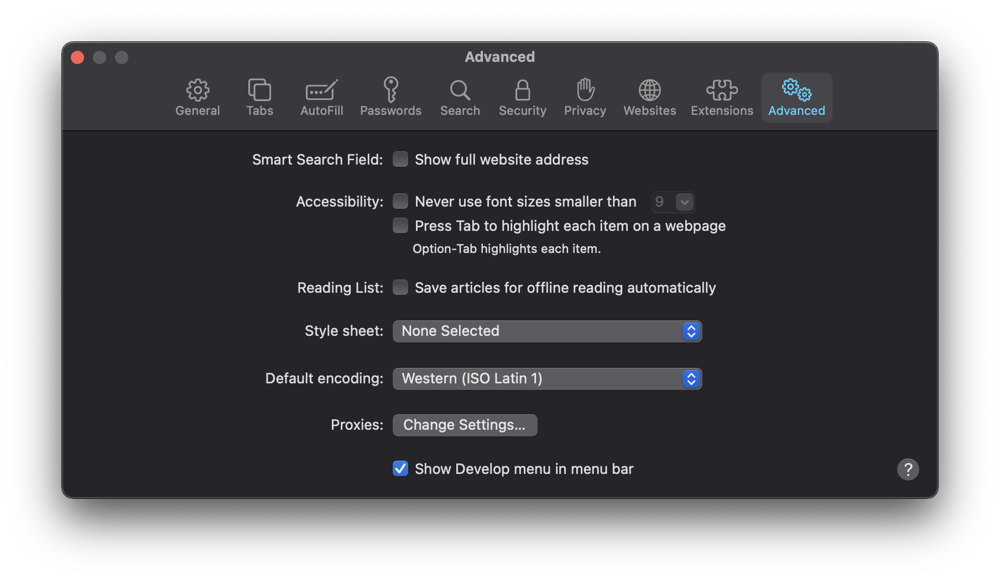
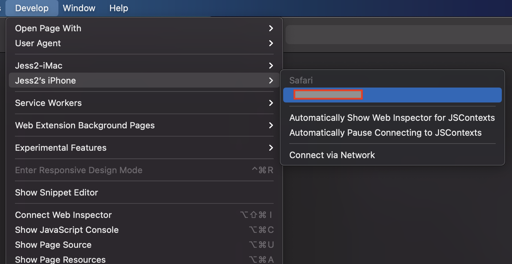
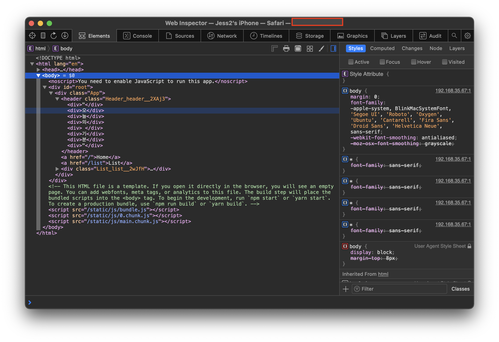
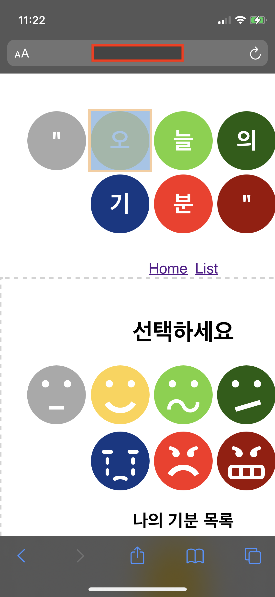

### 1. 프로젝트를 로컬 환경에서 실행시키기
```bash
$ npm start
```
- 주의: 프로젝트 실행 명령어는 프로젝트 설정에 따라 다르다.
- 로컬 환경의 프로젝트가 아닌 이미 배포되어 있는 웹페이지의 개발자도구를 열고 싶다면 이 단계는 건너 뛴다. 

<br>

### 2. iPhone 브라우저 앱에서 PC 로컬 환경에서 실행되고 있는 웹 사이트에 엑세스하기

#### 2-1. [mac] System Preferences 앱 → Network → IP 주소 확인

- 모바일에서 PC 로컬 환경에서 실행되고 있는 프로젝트를 실행시키고 싶다면 IP 주소를 확인해야 한다.



<br>

#### 2-2. [iPhone] Safari 앱 → 브라우저 주소창에 `xxx.xxx.xx.xx:{포트번호}` 입력  

- 주의: PC 브라우저에서는 `localhost:{포트번호}` 로 실행 가능하지만 Mobile 에서는 `{IP주소}:{포트번호}` 로 접속해야 한다.
- 예를 들어, IP 주소가 `123.456.78.90` 이고 로컬 환경에서 실행시킨 프로젝트의 포트 번호가 `3000`이면   
→ 모바일 브라우저 주소창에 `123.456.78.90:3000` 입력한다.



<br>

### 3. iPhone Safari Inspector(개발자 도구) 설정

- [iPhone] Settings 앱 → Safari → Advanced → Web Inspector 설정 On!!



<br>

### 4. mac Safari Inspector(개발자 도구) 설정

#### 4-1. [mac] Safari 앱 오픈 → 메뉴바에서 Safari → Preferences 열기


<br>

#### 4-2. Advanced 탭 → 하단의 `Show Develop menu in menu bar` 체크



<br>

#### 4-3. Safari 메뉴바에 Develop 메뉴가 새로 생김 


<br>

#### 4-4. mac에 iPhone을 케이블 선으로 연결

<br>

#### 4-5. Safari 메뉴바의 Develop 메뉴 → 연결된 iPhone의 Safari 앱에서 접속하고 있는 주소 클릭 → 개발자도구(Web Inspector)가 실행됨 

- 주의1: PC와 Mobile을 연결하지 않으면 Mobile이 목록에 표시되지 않는다.
- 주의2: Mobile에서 Safari 브라우저로 접속한 사이트가 없으면 우측 목록에 표시되지 않는다. 



<br>

### 5. 실행 화면





