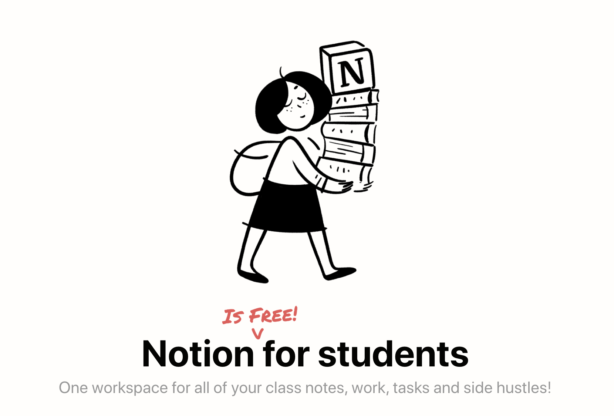
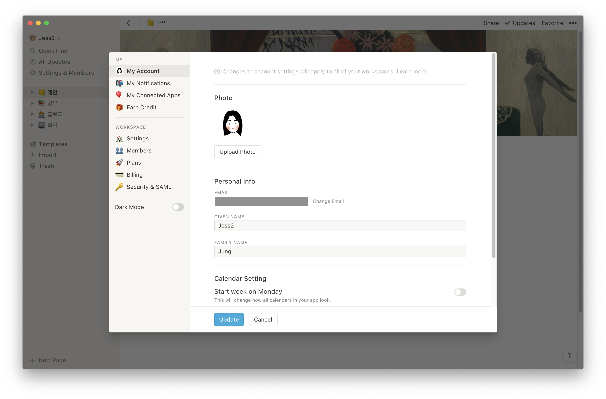

Notion을 용량 제한 없이 이용하려면 Personal Plan 기준으로 월 $5의 비용이 발생한다. 
그러나 이제 간단한 <b>학교 이메일 주소 인증</b>만으로 <b>Notion을 무료로 이용</b>할 수 있다. 
> Notion에 대한 더 자세한 정보는 [Notion 공식 홈페이지](https://www.notion.so/)에서 확인할 수 있다.

### Education Plan으로 Notion 무료 이용하기
1. Notion App 열기 (PC에서만 가능)
2. 노션 앱 왼쪽 상단의 Settings & Members 클릭
3. My Account 메뉴 -  Personal Info 에서 학교 이메일 주소를 입력후 Change Email 버튼 클릭

4. 학교 홈페이지로 접속하여 Notion에서 발송한 이메일로 학교 인증
5. Upgrade 메뉴 (기존에 Plan을 이용하고 있다면 Plans 메뉴) - Personal 탭 - Get free education plan 클릭

### Reference

- https://www.notion.so/students
- https://www.notion.so/Notion-for-students-teachers-adc631df15ee4ab9a7a33dd50f4c16fe
