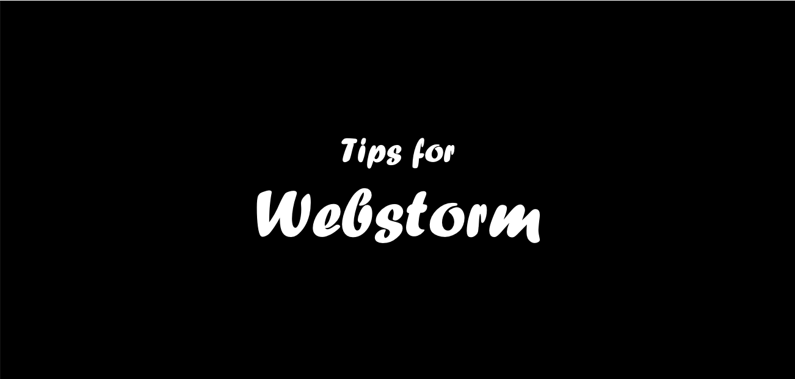
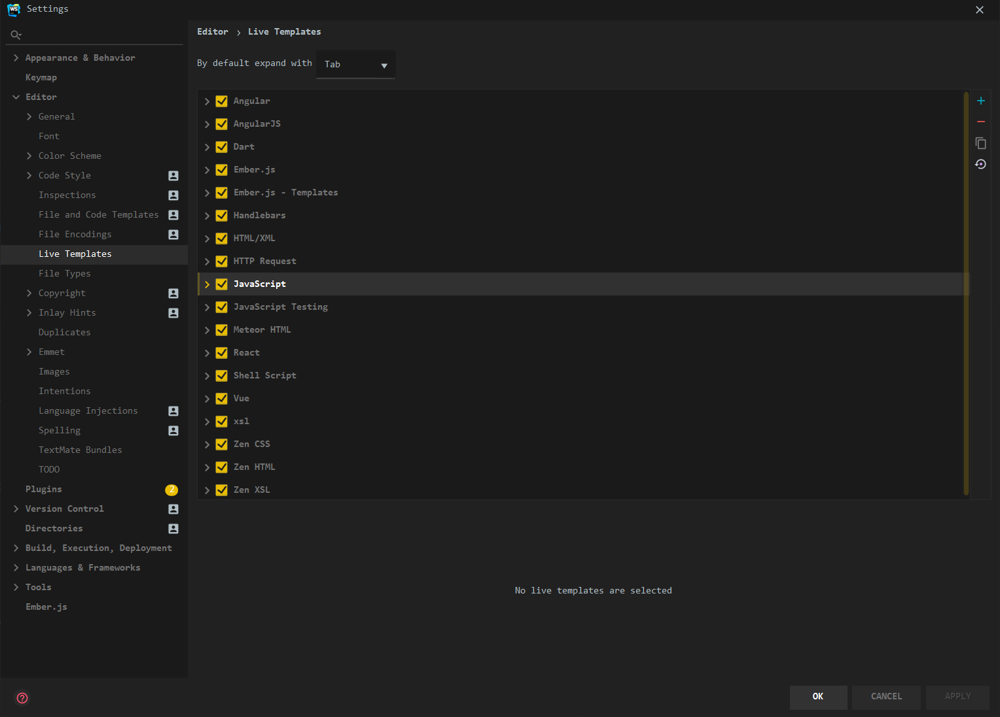
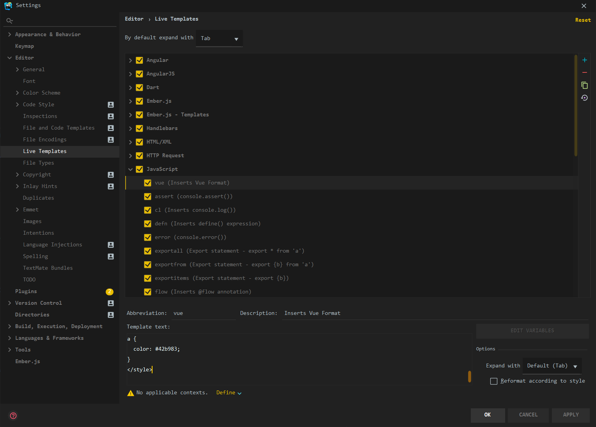

### 1. ShortCut 설정 창으로 이동하기

1. Webstorm - Preferences - Editor - Live Templates - (JavaScript 선택)
2. 우측의 + 버튼 클릭 - Live Templates 클릭

### 2. 단축어 설정하기


1. Abbreviation 입력창에 단축어 설정
2. Description 입력창에 설명 추가
3. Template text 입력창에 탬플릿 추가
4. 하단의 Define 드롭다운을 눌러 탬플릿을 사용할 수 있도록 하려는 **파일 형식** 선택

### 3. 실제 사용하기
- 에디터에 단축어를 입력한 후 tab 키를 누르면 사용 가능하다.
- default 설정은 tab으로 적용되어 있으며, Webstorm - Preferences - Editor - Live Templates 에서 변경 가능하다.

### 4. Vue 추천 단축어
```vue
<template>
  <div class="">
  </div>
</template>

<script>
  export default {
    name: '',
    props: [],
    data () {
      return {}
    },
    computed: {},
    mounted () {
    },
    watch: {},
    methods: {},
    components: {}
  }
</script>

<style scoped lang="scss">
  @import '';
</style>
```