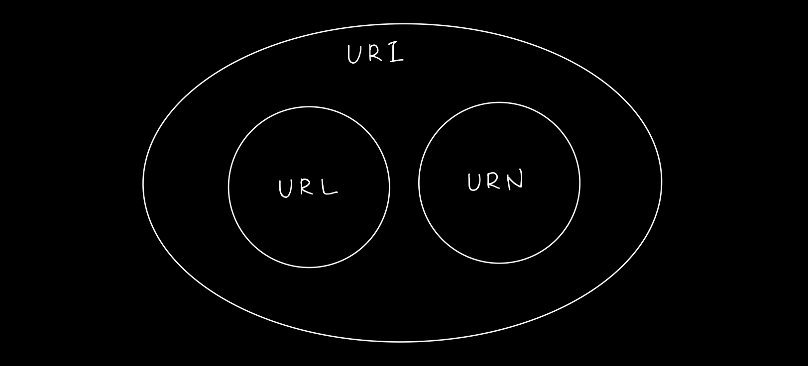

# 1. 인터넷 네트워크

### 1-1. 인터넷 통신과 IP (인터넷 프로토콜)

- 인터넷 망은 굉장히 복잡한데 이 복잡한 인터넷에서 클라이언트 컴퓨터와 서버 컴퓨터는 어떻게 통신할까? 이걸 알기 위해서는 IP (인터넷 프로토콜)에 대해서 학습을 해야 한다.  
IP 주소를 통해서 인터넷에서 클라이언트 컴퓨터와 서버 컴퓨터가 통신할 수 있다.

- IP (인터넷 프로토콜)의 역할
    - 지정된 IP 주소(IP Address)에 데이터 전달
    - 패킷(Packet)이라는 통신 단위로 데이터 전달 (데이터를 그냥 보내는 게 아니라 IP 패킷이라는 규칙이 있다.)
    - 패킷 = 패키지 + 버킷

- IP 패킷 정보
    - 출발지 IP, 도착지 IP, 전달하고 싶은 데이터, 기타 ...
    - IP 패킷 정보를 인터넷 망에 던지면 IP 프로토콜에 의해서 출발지와 목적지를 알고 있기 때문에 인터넷 망 내의 노드끼리 해당 IP 패킷 정보를 던지고 목적지까지 도달하게 된다.

- IP 프로토콜의 한계
    - 비연결성
        - 패킷을 받을 대상이 없거나 서비스 불능 상태여도 패킷 전송
    - 비신뢰성
        - 중간에 패킷이 사라지면?
        - 패킷이 순서대로 안오면?
    - 프로그램 구분
        - 같은 IP를 사용하는 서버에서 통신하는 애플리케이션이 둘 이상이면?
        
<br />

### 1-2. TCP

- TCP
    - TCP란, 전송 제어 프로토콜
    - IP 프로토콜을 이용한 전송 방식은 패킷이 소실되거나 패킷 전달 순서 문제가 발생할 수 있는데 TCP 프로토콜로 이 문제를 해결할 수 있다.
    - TCP는 IP 프로토콜 방식 윗 단계에서 보완해주는 기능을 한다.
    - TCP에는 출발지 PORT, 목적지 PORT, 전송 제어, 순서, 검증 정보 등이 들어가서 IP만으로는 해결이 안됐던 문제들을 해결해준다.

- 인터넷 프로토콜 스택의 4계층
    - 애플리케이션 계층 - HTTP, FTP
    - 전송 계층 - TCP, UDP
    - 인터넷 계층 - IP
    - 네트워크 인터페이스 계층 (LAN 드라이버, LAN 장비)

- TCP/IP를 이용한 데이터 전달 방식
    1. 애플리케이션 계층에서 전달할 데이터 생성
    2. 전달할 데이터에 TCP 정보를 생성해서 씌우고 또 IP와 관련된 정보들을 씌워서 IP 패킷을 생성함
    (즉, IP 패킷 안에는 IP 정보가 존재하고 그 안에 TCP 정보가 존재하고 또 그 안에 전달할 데이터가 존재하는 것이다.)
    3. 네트워크 인터페이스를 통해서 나갈 때는 이더넷 프레임이 포함되어 나간다.
    (이더넷 프레임은 LAN 카드에 등록된 MAC 주소와 같은 물리적인 정보들이 포함되어 있다.)

- TCP/IP 패킷 정보
    - IP : 출발지 IP, 목적지 IP, ...
    - TCP : 출발지 PORT, 목적지 PORT, 전송 제어, 순서, 검증 정보, ...
    - 전달할 데이터

- TCP 특징
    - 연결 지향 - TCP 3 way handshake (가상 연결)
        - 출발지와 목적지가 연결이 되어있나 먼저 확인을 하고 데이터를 보내기 위함
    - 데이터 전달 보증
        - 만약 데이터가 전달 되다가 중간에 소실되면 소실되었다고 클라이언트에 알려준다.
        - 데이터가 잘 전달되면 잘 전달되었다고 클라이언트에 알려준다.
    - 순서 보장
        - 순서가 다르게 도착하면 클라이언트에 알려준다.
        - ex) 패킷1, 패킷2, 패킷3 순서로 전송했는데 → 패킷1, 패킷3, 패킷2 순서로 도착하면 → 클라이언트에 패킷2부터 다시 보내라고 알려준다.
    - 신뢰할 수 있는 프로토콜
    - 현재 대부분 애플리케이션에서 TCP를 사용함
        
<br />

### 1-3. PORT

- PORT
    - 배가 도착하는 항구라는 뜻
    - 같은 pc (동일 IP)에서 여러 프로그램을 사용할 수 있는데 패킷을 주고받을 때 IP만으로는 어디로 보내야할지 알 수 없다. PORT를 이용해서 구분할 수 있다.
    - IP는 목적지의 서버를 찾는 것이고, 같은 IP 내에서 프로세스를 구분하는게 PORT

- PORT 번호 범위
    - 0 ~ 65535 : 할당 가능
    - 0 ~ 1023 : 잘 알려진 포트, 사용하지 않는 것이 좋음
        - FTP - 20, 21
        - TELNET - 23
        - HTTP - 80
        - HTTPS - 443
        
<br />

### 1-4. DNS (Domain Name System : 도메인 네임 시스템)

- IP의 문제점
    - IP는 기억하기 어렵다 (123.456.789.1 와 같은 형태)
    - IP는 변경될 수 있다.

- DNS로 해결
    - DNS : 도메인 네임 시스템
    - 중간에 전화번호부와 같은 서버를 제공해준다. (DNS 서버)
    - 도메인 명을 IP 주소로 변환해준다.

- DNS를 사용한 통신
    1. DNS 서버에 <도메인 명, IP 주소> 쌍을 등록
    2. 클라이언트에서 도메인 명으로 찾는다
    3. DNS 서버가 도메인 명에 맞는 IP 주소를 클라이언트에 응답으로 준다.
    4. 클라이언트에서 해당 IP 주소를 가진 서버에 접근한다.
        
<br />

# 2. URI와 웹 브라우저 요청 흐름

### 2-1. URI

- URI (Uniform Resource Identifier)
    - Uniform : 리소스 식별하는 통일된 방식
    - Resource : 자원, URI로 식별할 수 있는 모든 것 (제한 없음)
    - Identifier : 다른 항목과 구분하는데 필요한 정보
    - 즉, URI는 리소스를 식별하는 통합된 방법이다.
    - URI(Resource Indetifier) / URL(Resource Locator) / URN(Resource Name)
    - URI는 Locator, Name, 또는 둘 다 추가로 분류될 수 있다.
        

- URL (Uniform Resource Locator)
    - 리소스가 있는 위치를 지정
    - `foo://example.com:8080/over/there?name=jessie#nose` 와 같은 형태

- URN (Uniform Resource Name)
    - 리소스에 이름을 부여
    - URN 이름만으로 실제 리소스를 찾을 수 있는 방법이 보편화 되지 않아서 거의 안씀
    - `urn:example:person:jessie:nose` 와 같은 형태

- URL 분석 example

    ```
    scheme://[userinfo@]host[:port][/path][?query][#fragment]
    https://www.google.com/search?q=hello&hl=ko
    ```

    - `https` : protocol
    - `www.google.com` : host name
    - `443` : port number
    - `/search` : path
    - `q=hello&hl=ko` : query parameter

- URL scheme
    - 주로 프로토콜 사용
    - 프로토콜 : 어떤 방식으로 자원에 접근할 지 약속 규칙 (http, https, ftp, ...)

- URL userinfo@
    - URL에 사용자 정보를 포함해서 인증할 때 사용
    - 거의 안씀

- URL host
    - 호스트명
    - 도메인명 또는 IP주소 직접 사용 가능

- URL port
    - 접속 포트
    - http는 80 포트, https는 443 포트를 주로 사용, 포트는 생략 가능

- URL path
    - 리소스 경로(path), 계층적 구조
    - example : `/members/100`, `/items/iphone2`

- URL query
    - key=value 형태
    - ?로 시작, &로 추가 가능
    - example : `?keyA=value&keyB=valueB`
    - query parameter, query string 등으로 불림
    - 웹 서버에 제공하는 문자 형태의 파라미터

- URL fragment
    - 페이지 내에서 특정 위치로 이동할 때 사용
    - 서버에 전송하는 정보 아님
        
<br />

### 2-2. 웹 브라우저 요청 흐름

1. 웹 브라우저에서 [https://www.google.com:443/search?q=hello&hl=ko](https://www.google.com:443/search?q=hello&hl=ko) 로 접속
2. 웹 브라우저가 먼저 구글 서버를 찾아야 하기 때문에 DNS 조회해서 IP 주소를 얻어옴
3. 웹 브라우저가 HTTP 요청 메세지 생성

    ```
    GET /search?q=hello&hl=ko HTTP/1.1 Host:www.google.com
    ```

4. SOCKET 라이브러리를 통해 전달 (TCP/IP 연결, 데이터 전달)
5. TCP/IP 패킷 생성, HTTP 메세지(전송 데이터) 포함
6. 이 패킷 정보가 인터넷으로 흘러가고 도착지 서버 컴퓨터에 도달하게 됨
7. 서버에서는 요청 패킷 정보가 도착하면 HTTP 메세지를 가지고 해석한 후 데이터를 찾고 응답 메세지를 생성

    ```
    HTTP/1.1 200 OK
    Content-Type: text/html;charset=UTF-8
    Content-Length: 3423

    <html>
    	<body>...</body>
    </html>
    ```

    - Content-Type : 응답하는 데이터 형식
    - Content-Length : 응답하는 데이터의 길이
8. 서버에서도 클라이언트에서 만들었던 방식으로 **응답 패킷**을 생성해서 클라이언트에게 보낸다.
9. 웹 브라우저에서 응답 패킷을 까서 받아온 데이터를 이용해 브라우저에 렌더링한다.
10. 사용자가 화면을 볼 수 있게 된다.
        
<br />

# 3. HTTP 기본

### 3-1. 모든 것이 HTTP

- HTTP란
    - HyperText Transfer Protocol
    - 처음에는 HTML을 전송하는 프로토콜로 시작이 되었지만 지금은 거의 모든 형태의 데이터를 HTTP 프로토콜에 담아서 전송한다. (이미지, 음성, 영상, 파일, JSON, XML, ...)

- HTTP 역사
    - HTTP/0.9 (1991) : GET 메서드만 지원, HTTP 헤더 X
    - HTTP/1.0 (1996) : 메서드, 헤더 추가
    - HTTP/1.1 (1997) : 가장 많이 사용, 우리에게 가장 중요한 버전
        - 연결당 하나의 요청과 응답을 처리하기 때문에 동시 전송 문제와 다수의 리소스를 처리하기에 속도와 성능 이슈가 존재
    - HTTP/2 (2015) : 성능 개선
        - Multiplexed Streams (한 커넥션에 여러개의 메세지를 동시에 주고 받을 수 있음)
    - HTTP/3 (진행중) : TCP 대신에 UDP 사용, 성능 개선

- 기반 프로토콜
    - **TCP** : HTTP/1.1, HTTP/2
    - **UDP** : HTTP/3
    - 현재 HTTP/1.1 을 주로 사용 (HTTP/2, HTTP/3도 점점 증가)

- HTTP 특징
    - 클라이언트 서버 구조
        - Request & Response 구조
        - 클라이언트는 서버에 요청을 보내고, 응답을 대기
        - 서버는 받은 요청에 대한 결과를 만들어서 응답
    - 무상태 프로토콜(Stateless), 비연결성
    - HTTP 메세지
    - 단순함, 확장 가능
        
<br />

### 3-2. Stateless와 Stateful

- Stateless (무상태 프로토콜)
    - HTTP의 중요한 특징 중의 하나는, Stateless를 지향한다는 것.
    - 서버가 클라이언트의 상태를 보존하지 않음.
    - 장점 : 서버 확장성 높음 (스케일 아웃)
    - 단점 : 클라이언트가 추가 데이터 전송

- Stateful (상태 유지)
    - 서버가 클라이언트의 이전 상태를 보존하는 것.

- Stateful / Stateless 차이를 보여주는 example
    - Stateful - example 1 (동일한 점원)

        ```
        // 첫 번째 요청
        - 고객: 이 노트북 얼마인가요?
        - 점원A : 100만원입니다

        // 두 번째 요청
        - 고객: 2개 구매할게요
        - 점원A : 200만원입니다.
        ```

        점원A는 고객의 이전 상태를 유지하고 있기 때문에 두 번째 요청에서 고객이 어떤 걸 구매하겠다고 말하지 않았는데도 점원A는 노트북 2개로 이해하고 계산한다.

    - Stateful - example2 (요청마다 점원이 달라진 경우)

        ```
        // 첫 번째 요청
        - 고객: 이 노트북 얼마인가요?
        - 점원A : 100만원입니다

        // 두 번째 요청
        - 고객: 2개 구매할게요
        - 점원B : ? 무엇을 2개 구매하시겠어요?
        ```

        점원B는 고객이 어떤 걸 구매하려고 하는지 알 수 없기 때문에 장애가 발생한다.

    - Stateless

        ```
        // 첫 번째 요청
        - 고객: 이 노트북 얼마인가요?
        - 점원A : 100만원입니다

        // 두 번째 요청
        - 고객: 노트북 2개 구매할게요
        - 점원B : 200만원입니다.
        ```

        무상태에서는 고객이 요청마다 필요한 데이터를 다 전달하기 때문에 요청마다 동일한 점원이든 점원이 달라지든 상관없다.

- Stateless의 실무 한계
    - 모든 것을 무상태로 설계할 수 없는 경우가 있다.
    - 무상태
        - ex) 로그인이 필요없는 단순한 서비스 소개 화면
    - 상태 유지
        - ex) 로그인
    - 로그인한 사용자의 경우 로그인했다는 상태를 서버에 유지해야 한다.
    - 일반적으로 브라우저 쿠키와 서버 세션 등을 사용해서 상태를 유지한다.
    - 상태 유지는 최소한만 사용
        
<br />

### 3-3. 비 연결성(connectionless)

- TCP/IP 연결을 유지하는 모델의 단점
    - 클라이언트가 서버에 새로운 요청을 하지 않고 있더라도 연결이 되어있으면 서버의 자원을 불필요하게 소모하게 된다

- TCP/IP 연결을 유지하지 않는 모델
    - 클라이언트가 요청하고 서버로부터 응답 받은 이후에는 TCP/IP 연결 종료하는 방식
    - 서버는 연결을 유지하지 않아도 되기 때문에 최소한의 자원만을 사용할 수 있다.

- 비 연결성 소개
    - HTTP는 기본이 '연결을 유지하지 않는 모델'
    - 일반적으로 초 단위 이하의 빠른 속도로 응답
    - 1시간 동안 수천 명이 서비스를 사용해도 실제 서버에서 동시에 처리하는 요청은 수십개 이하로 매우 작음
        - ex) 웹 브라우저에서 계속 연속해서 검색 버튼을 누르지는 않기 때문.
    - 서버 자원을 매우 효율적으로 사용할 수 있음.

- 비 연결성의 한계와 극복
    - TCP/IP 연결을 요청마다 매번 새로 맺어야 함 - 3 way handshake 시간이 추가됨
    - 웹 브라우저로 사이트를 요청하면 HTML 뿐만 아니라 자바스크립트, CSS, 추가 이미지 등 수많은 자원이 함께 다운로드
    - 지금은 HTTP 지속 연결(Persistent Connections)로 문제 해결
        - 무조건 요청/응답 끝나면 바로 끊어버리는 게 아니라 특정 시간 동안 연결을 유지했다가 끊는다.
    - HTTP/2, HTTP/3 에서 더 많은 최적화
        
<br />

# 4. HTTP 메서드

### 4-1. HTTP API URI 설계

- 나쁜 API URI 설계 Example - 회원 정보 관리 API
    - 회원 목록 조회 `/read-member-list`
    - 회원 조회 `/read-member-by-id`
    - 회원 등록 `/craete-member`
    - 회원 수정 `/update-member`
    - 회원 삭제 `/delete-member`

- API URI 설계에서 가장 중요한 것은 **리소스 식별!**
    - 위의 회원 정보 관리 API 예제에서 리소스는 ⇒ '회원' 이다.
    - 회원을 등록하고 수정하고 조회하는 것을 모두 배제
    - 회원이라는 리소스만 식별하면 된다 ⇒ 회원 리소스를 URI에 매핑!

- 좋은 API URI 설계 Example - 회원 정보 관리 API
    - **회원** 목록 조회 `/members`
    - **회원** 조회 `/members/{id}`
    - **회원** 등록 `/members/{id}`
    - **회원** 수정 `/members/{id}`
    - **회원** 삭제 `/members/{id}`
    - 참고 : 계층 구조상 상위를 컬렉션으로 보고 복수 단어 사용 권장 (`member` → `members`)
    - 위에서 회원 조회/등록/수정/삭제를 구분하는 방법이 HTTP 메서드!

- 리소스와 행위를 분리하자
    - 가장 중요한 것은 리소스를 식별하는 것
    - URI는 리소스만 식별!
    - **리소스**와 해당 리소스를 대상으로 하는 **행위**를 분리
        - 리소스 : 회원
        - 행위 : 조회, 등록, 삭제, 변경
        
<br />

### 4-2. HTTP 메서드 - GET, POST, PUT, PATCH, DELETE

- HTTP 메서드란?
    - 클라이언트에서 서버로 뭔가를 요청할 때 기대하는 행동!

- 주로 사용되는 HTTP 메서드
    - `GET` : 리소스 조회
    - `POST` : 요청 데이터 처리, 주로 등록에 사용
    - `PUT` : 리소스를 대체, 해당 리소스가 없으면 생성
    - `PATCH` : 리소스 부분 변경
    - `DELETE` : 리소스 삭제

- 기타 HTTP 메서드
    - `HEAD` : GET 과 동일하지만 메세지 부분을 제외하고 상태 줄과 헤더만 반환
    - `OPTIONS` : 대상 리소스에 대한 통신 가능 옵션(메서드)을 설명 (주로 CORS에서 사용)
    - `CONNECT` : 대상 자원으로 식별되는 서버에 대한 터널을 설정
    - `TRACE` : 대상 리소스에 대한 경로를 따라 메세지 루프백 테스트를 수행

- GET
    - 리소스 조회
    - 서버에 전달하고 싶은 query (쿼리 파라미터, 쿼리 스트링)를 통해서 전달
    - 메세지 바디(Request Body)를 사용해서 데이터를 전달할 수 있지만, 지원하지 않는 곳이 많아서 권장하지 않음.

- POST
    - 요청 데이터 처리
    - 메세지 바디(Request Body)를 통해서 서버로 요청 데이터를 전달
    - 서버는 요청 데이터를 처리
    - 메세지 바디를 통해 들어온 데이터를 처리하는 모든 기능을 수행한다.
    - 주로 전달된 데이터로 **신규 리소스 등록 or** **요청 데이터 처리**에 사용한다.
        - 신규 리소스 등록
            - 서버가 아직 식별하지 않은 새 리소스 생성
        - 요청 데이터 처리
            - 단순히 데이터를 생성하거나 변경하는 것을 넘어서 프로세스를 처리해야 하는 경우
            - ex) 주문 결제 완료 → 배달 시작 → 배달 완료
            - POST의 결과로 새로운 리소스가 생성되지 않을 수도 있음
            - ex) POST /orders/{orderId}/start-delivery **(컨트롤 URI)**
        - 다른 메서드로 처리하기 애매한 경우
            - JSON으로 조회 데이터(Request Body)를 넘겨야 하는데, GET 메서드를 사용하기 어려운 경우
            - 어떤 메서드를 사용해야 할 지 애매하면 POST

- PUT
    - 리소스를 대체
        - 리소스가 있으면 대체
        - 리소스가 없으면 생성
        - 쉽게 이야기해서 리소스를 덮어버림
    - POST와의 차이점은 PUT은 클라이언트가 리소스를 식별한다. 즉, 리소스의 위치를 알고 URI를 지정한다.
    - 주의! PUT은 리소스를 완전히 대체한다
        - ex) `PUT /members/100` 에 Request Body로 `{ "age": 50 }`를 전송하면 서버에 `{ "name": "Jessie", "age": 20 }` 으로 있었더라도 `name` 필드가 삭제되고 `{ "age": 50 }`로 대체 된다.
        - PUT은 기존 리소스를 수정하는 게 아니라 갈아치우는 것.
        - 리소스의 부분만 수정하고 싶다면 PUT이 아니라 PATCH를 사용하자.

- PATCH
    - 리소스 부분 변경

- DELETE
    - 리소스 제거
        
<br />

### 4-3. HTTP 메서드의 속성

| HTTP 메서드 | 요청에 Body 존재 | 응답에 Body 존재 | 안전 | 멱등 | 캐시 가능 |
|-----------|---------------|---------------|-----|----|---------|
|GET	|X	|O	|O	|O	|O|
|HEAD	|X	|X	|O	|O	|O|
|POST	|O	|O	|X	|X	|O|
|PUT	|O	|O	|X	|O	|X|
|DELETE	|X	|O	|X	|O	|X|
|CONNECT	|O	|O	|X	|X	|X|
|OPTIONS	|선택사항	|O	|O	|O	|X|
|TRACE	|X	|O	|O	|O	|X|
|PATCH	|O	|O	|X	|X	|O|

- 안전
    - 호출해도 리소스를 변경하지 않는다.

- 멱등
    - 한 번 호출하든 백 번 호출하든 결과가 똑같다.
    - 멱등 여부는 서버가 TIMEOUT 등으로 정상 응답을 못주었을 때, 클라이언트가 같은 요청을 다시해도 되는가? 판단 근거가 된다.

- 캐시 가능
    - 응답 결과 리소스를 캐시해서 사용해도 되는가?
    - GET, HEAD, POST, PATCH 캐시 가능
    - 실제로는 GET, HEAD 정도만 캐시로 사용
        - POST, PATCH는 본문 내용까지 캐시 키로 고려해야 해서 구현이 쉽지 않음
        
<br />

# 5. HTTP 메서드 활용

- TBD
        
<br />

# 6. HTTP 상태코드

- TBD
        
<br />

# 7. HTTP 헤더1 - 일반 헤더

- TBD
        
<br />

# 8. HTTP 헤더2 - 캐시와 조건부 요청

- TBD
        
<br />

# Reference

- [모든 개발자를 위한 HTTP 웹 기본 지식]([https://www.inflearn.com/course/http-웹-네트워크](https://www.inflearn.com/course/http-%EC%9B%B9-%EB%84%A4%ED%8A%B8%EC%9B%8C%ED%81%AC))