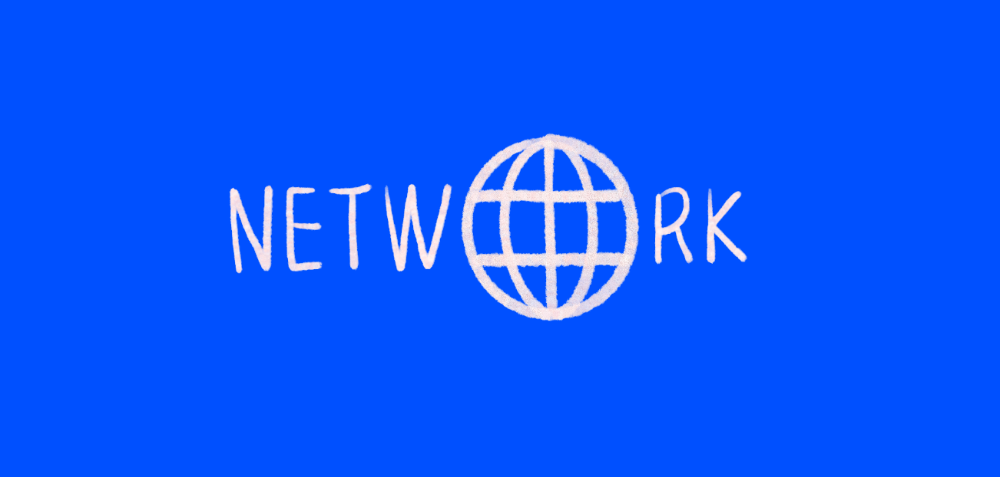

# HTTP 응답 상태 코드 5가지 종류

- 100번대 : 정보를 제공하는 응답
- 200번대 : 성공적인 응답
- 300번대 : 리다이렉트
- 400번대 : 클라이언트 에러
- 500번대 : 서버 에러

 

# 200번대 (정상)

### 200 OK

- 요청이 성공적으로 완료됨

### 201 Created

- 요청이 성공적으로 완료됨
- 요청 결과로 새로운 리소스가 생성됨
- 이 응답은 일반적으로 POST 요청 / 일부 PUT 요청 이후에 발생함

 

# 300번대 (리다이렉트)

### 301 Moved Permanently

- 요청한 리소스의 URI가 변경됨
- 요청한 페이지가 새 위치로 영구적으로 이동됨

 

# 400번대 (클라이언트 에러)

### 400 Bad Request

- 잘못된 문법으로 요청해서 서버가 요청을 이해할 수 없음
- ex) 클라이언트에서 HTTP 요청시 request body를 잘못 보냄

### 401 Unauthorized

- 미승인, 비인증
- ex) 만료된 토큰으로 HTTP 요청

### 403 Forbidden

- 컨텐츠 접근 권한이 없음
- 401과 다른점은 401은 서버가 클라이언트가 누군지 알고 있지 않지만 403은 서버가 클라이언트가 누군지 알고 있다는 것

### 404 Not Found

- 요청받은 리소스를 서버에서 찾을 수 없음
- 브라우저에서는 알려지지 않은 URL을 의미함

### 409 Conflict

- 요청이 현재 서버의 상태와 충돌함
- ex) 회원가입 시도시 아이디가 이미 존재하는 경우

 

# 500번대 (서버 에러)

### 500 Internal Server Error

- 서버 내부 오류
- 서버가 처리 방법을 모르는 상황

### 502 Bad Gateway

- 서버가 요청을 처리하는 데 필요한 응답을 얻기 위해 게이트웨이로 작업하는 동안 잘못된 응답을 수신함

### 503 Service Unavailable

- 서버가 요청을 처리할 준비가 되지 않음
- 일반적인 원인은 유지보수를 위해 작동이 중단되거나 과부하가 걸린 경우임

 

# Reference

- [https://developer.mozilla.org/ko/docs/Web/HTTP/Status](https://developer.mozilla.org/ko/docs/Web/HTTP/Status)