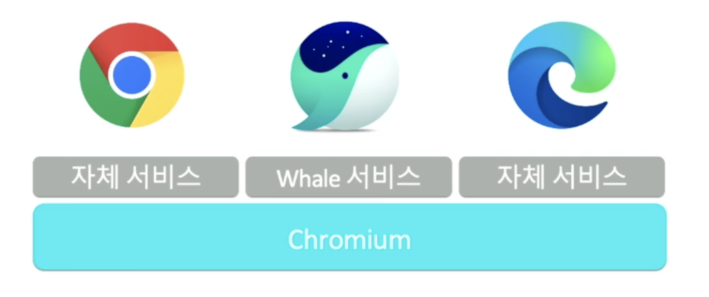

> 2021 NAVER DEVIEW **[<슬기로운 웨일앱 개발>](https://tv.naver.com/v/23652538)** 세션 들으며 정리한 내용

# 1. 웨일 앱이란?

- Whale platform(Whale 브라우저나 Whale OS)에서 동작하는 확장앱

## Whale Platform

- Chromium 기반 웹 서비스 플랫폼
- Chromium 오픈소스 + Whale만의 서비스
- Chromium 기능으로만 구성된 앱은 다른 브라우저에서 동일하게 동작
    

<br />

# 2. 웨일 앱을 만들어보자

## 추천하는 프로젝트 구성

- src: 실제 빌드되는 소스파일 모음
- dist: 최종 결과물이 저장되는 배포 버전 파일
- public: 빌드와 관련 없는 파일. 그대로 복사해서 dist 폴더로 이동
- 그 외 설정 파일들...

## 확장앱 유일한 필수 파일 - public/manifest.json

```json
"manifest_version": 2,
"name": "__MSG_APP_NAME__",
"description": "__MSG_APP_DESCRIPTION__",
"default_locale": "ko",
"version": "1.0.1",
"icon": {
  "16": "icons/icon16.png",
  "48": "icons/icon48.png",
  "128": "icons/icon128.png"
},
"content_scripts": [
  {
    "matches": [
      "http://*/*",
      "https://*/*"
    ],
    "js": [ "js/content-script.js" ],
    "css": [ "css/content-style.css" ],
    "run_at": "document_start"
  }
],
"background": {
  "scripts": [
    "js/background.js"
  ]
},
"permissions": [
  "<all_urls>"
],
"content_security_policy": "script-src 'self' 'unsafe-eval'; object-src 'self'"
```

- `manifest_version`: 2 고정
- `name`: 확장앱 이름
- `description`: 확장앱 설명
- `version`: 확장앱 버전
- `icon`: 확장앱 관리자 페이지에 표시되는 아이콘 (사이즈별)
- `content_scripts`
    - 확장앱의 실질적인 코드를 담고있음
    - JS, CSS 파일을 특정 페이지에 추가
    - DOM 접근 가능
    - 속성 종류
        - `matches`: content script가 실행되는 페이지를 지정
        - `js`: 불러올 js 파일
        - `css`: 불러올 css 파일
        - `run_at`: content script가 실행되는 시점. document가 렌더링되기 전이나 후로 지정할 수 있다.

## 인스타그램의 댓글 부분 안보이게 처리하는 확장앱을 만들어보자

1. matches 설정
    
    ```json
    "matches": [
      "http://www.instagram.com/*",
      "https://www.instagram.com/*"
    ],
    ```

2. 인스타그램의 댓글 부분 안보이게 처리하기
    
    ```css
    .HP0qD {
      display: none !important;
    }
    ```
    
    1. 개발자도구에서 댓글 부분 class명 체크 : `.HP0qD`
    2. 해당 class명에 css `display: none` 속성 추가
    3. 우선 순위가 가장 높아야 하므로 `!important` 추가

3. 빌드

4. 테스트
    1. 확장앱 관리 페이지(whale://extensions/) 에 접속
    2. 개발자 모드 toggle on
    3. 압축해제 된 확장앱 설치 버튼 클릭
    4. dist 폴더 선택
    5. 인스타그램 페이지에서 새로고침 후 정상 동작하는지 확인
    

## 확장앱 페이지

- 확장앱은 확장앱 내부에 HTML 페이지를 포함할 수 있는데, 이를 확장앱 페이지라고 한다.
- 확장앱 페이지에서 실행되는 JS는 브라우저 API를 사용할 수 있고 각 페이지마다 별도의 인스턴스로 동작한다.
- 위에서 다뤘던 content scripts는 특정 웹 페이지에 JS나 CSS를 주입해서 웹 페이지에서 동작했다면 확장앱 페이지는 확장앱 자신의 고유한 HTML 을 가지고 띄운다는 차이가 있다.
- 확장앱 페이지는 확장앱의 설정이나 컨트롤 페이지로 사용되거나 특정 웹페이지에 종속되지 않는 계산기나 달력 같은 도구 모음으로 사용된다.
- whale-extension://<확장앱 ID>/ 주소를 갖는다.
- `page_action`, `browser_action`, `sidebar_action` 속성을 이용해서 원하는 위치에 HTML 페이지를 띄울 수 있다.
    - page_action
        - 브라우저 주소창 내부에 추가된다.
        - 특정 페이지에서 동작
    - browser_action
        - 브라우저 주소창 옆 툴바에 추가
        - 모든 페이지에서 동작
        - 조건을 추가해 page_action처럼 동작 가능
    - sidebar_action
        - 브라우저  사이드바에 추가
        - 웨일 브라우저 전용 기능
        - page_action, browser_action에 비해 넓은 화면을 활용할 수 있다는 장점이 있다.
        
        ```json
        "sidebar_action": {
          "default_page": "index.html",
          "default_icon": {
            "48": "icons/icon48.png",
            "192": "icons/icon192.png"
          },
          "default_title": "__MSG_APP_NAME__",
          "use_navigation_bar": true
        }
        ```
        

## 백그라운드 페이지

- 페이지에 종속되지 않은 페이지
- 확장앱 페이지의 일종으로 특정 탭이나 윈도우에 종속되지 않은 백그라운드 포레스트를 가지고 있는 페이지
- 화면에 드러나지 않기 때문에 DOM 접근 불가능
- 모든 브라우저 API 사용 가능

## 메시지 교환

- Content Scripts와 확장앱/백그라운드 페이지간 데이터 교환
- 서로 다른 맥락에서 동작하는 페이지들끼리 메세지를 교환
- 보낼 때: `.sendMessage()`
- 받을 때: `.onMessage()`

## Debug

- 각 페이지마다 개발자 도구 확인
- 서로 다른 맥락에서 동작하는 페이지들은 각자의 개발자 도구 확인 가능
- contents script는 해당 document에서 개발자도구를 열면 확인 가능
- sidebar를 비롯한 확장앱 페이지는 해당 html에서 개발자도구를 열면 확인 가능
- 백그라운드 페이지는 확장앱 관리 페이지에서 해당 확장앱을 선택한 후 개발자도구 탭 > 뷰 검사: 백그라운드 페이지 버튼 클릭하면 개발자도구 확인 가능
- 각 페이지의 개발자도구를 통해 메세지가 어떻게 전송이 되었는지, 에러가 발생하지 않는지, 데이터를 잘 추출했는지 등을 확인할 수 있다.

<br />

# 3. 웨일 스토어에 업로드

1. 웨일 스토어 접속
2. 개발자 등록
3. 확장앱 관리 - 새로운 확장앱 추가 버튼 클릭
4. 압축 파일 선택하여 업로드
    - webpack이나 rollup같은 번들러를 사용하면 조금 더 편하게 빌드 배포를 자동화할 수 있다.
5. 확장앱 정보 입력
    - 언어
    - 앱 아이콘
    - 스크린샷 이미지 (1~4장)
    - 상세 설명
    - 분류
    - 공개 설정 선택
6. 리뷰 요청
    - 리뷰 요청을 하면 네이버 보안팀과 웨일에서 해당 확장앱의 적합성 유무를 판단하여 스토어에 등록된다.

<br />

# Reference

- [슬기로운 웨일앱 개발](https://tv.naver.com/v/23652538)