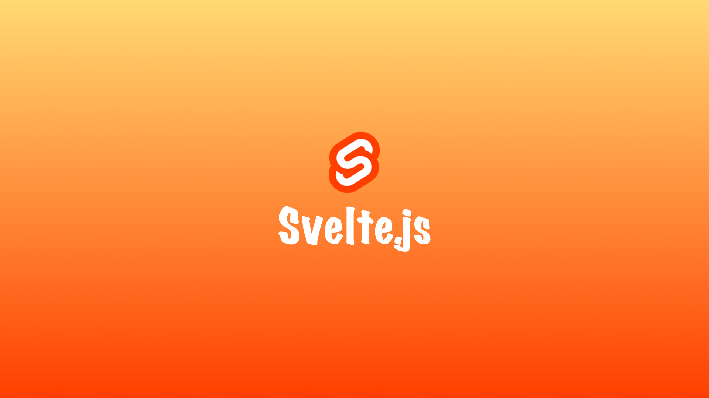
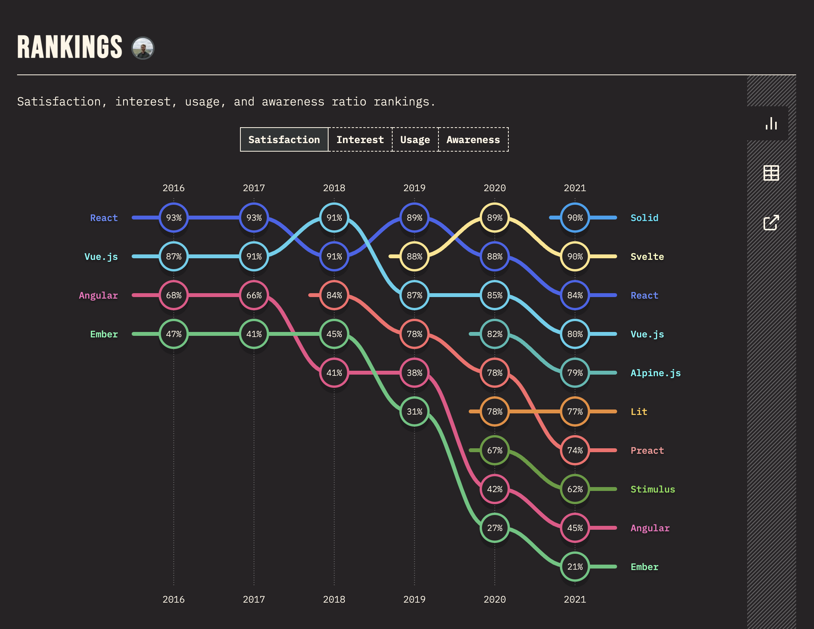
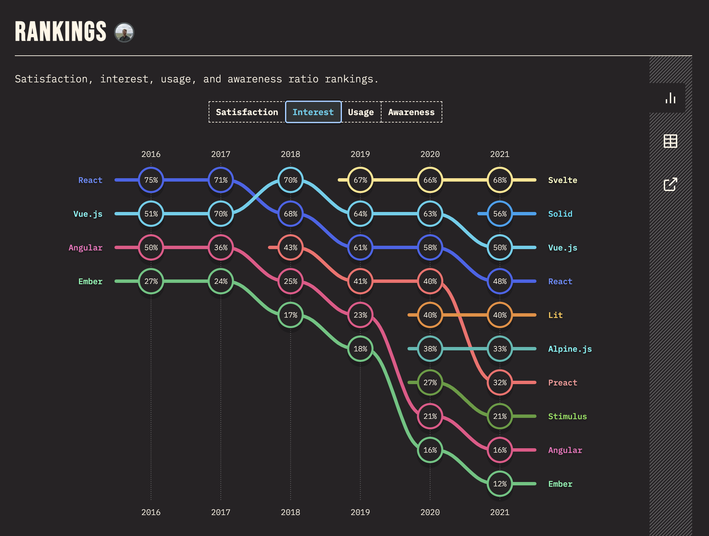
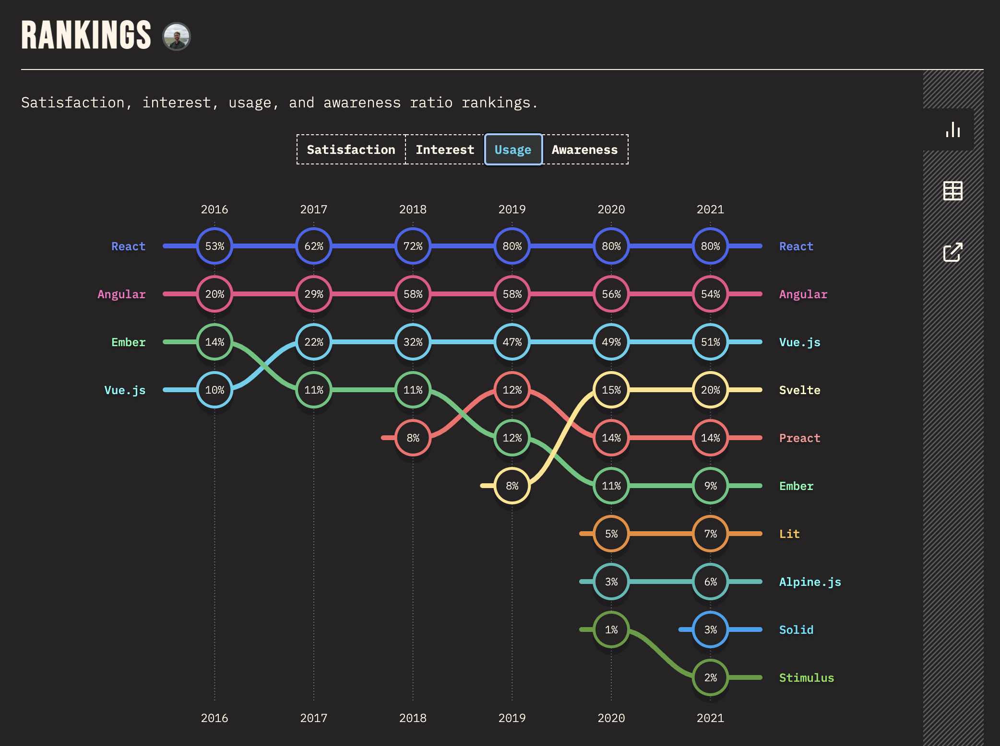
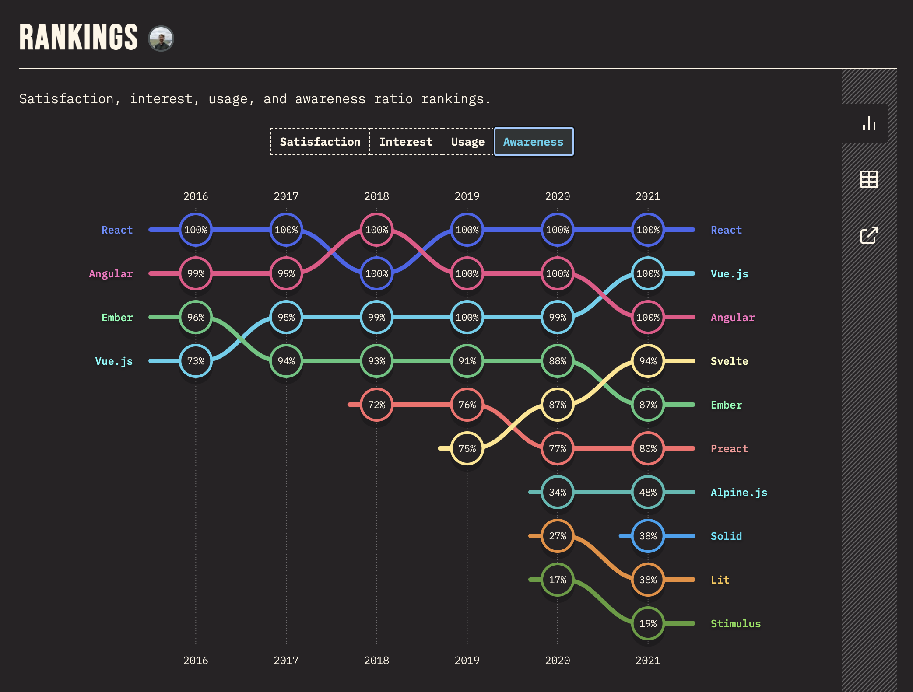
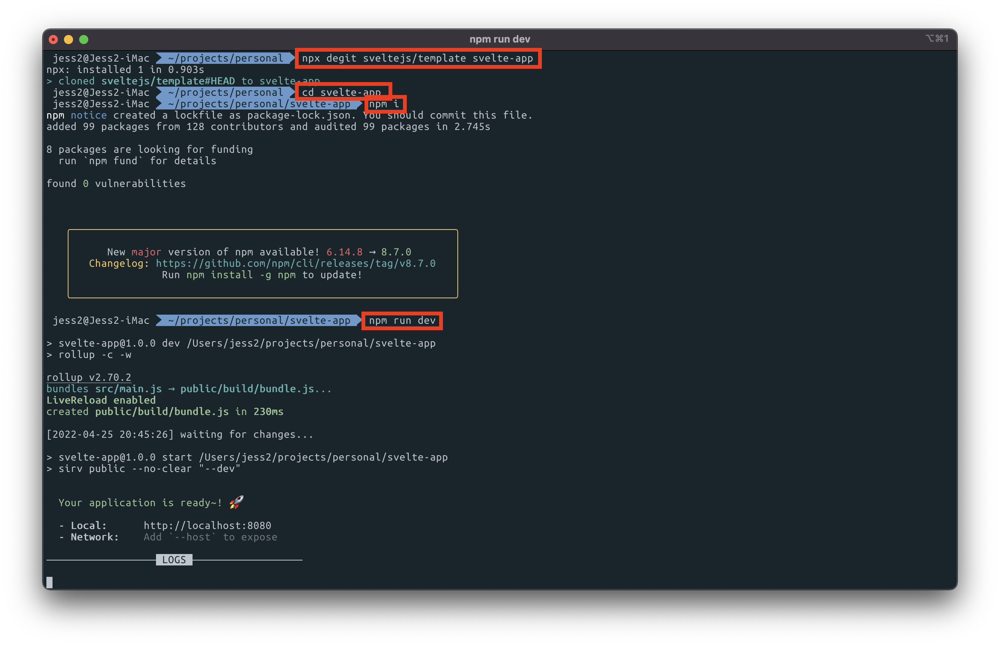

# 0. Index

1. 스벨트 시작하기
2. 기본 개념
3. 라이프사이클
4. 보간법
5. 반응성
6. 클래스와 스타일
7. 요소 바인딩
8. 조건과 반복과 키
9. 비동기
10. 사용자 입력 핸들링
11. 컴포넌트
12. 슬롯
13. 스토어
14. 액션
15. 특별한 요소
16. Trello 클론 앱 만들기 - 예제 이해하기
17. Trello 클론 앱 만들기 - 예제 실습
18. Snowpack
19. Trello 클론 앱을 Snowpack 프로젝트로 이관하기

# 1. 스벨트 시작하기

## 1-1. Svelte?

- [https://svelte.dev/](https://svelte.dev/)
- Rich Harris가 제작한 새로운 접근 방식의 Front-End Framework
- Release History
    - (2016-11) 1.0 Release
    - (2018-04) 2.0 Release
    - (2019-04) 3.0 Release **→ 많은 부분이 바뀌면서 주목받기 시작함 ✨**

<br />

## 1-2. state of js

- [https://2021.stateofjs.com/en-US/libraries/front-end-frameworks](https://2021.stateofjs.com/en-US/libraries/front-end-frameworks)
- 만족도
    
    
    
- 관심도
    
    
    
- 사용
    
    
    
- 인지도
    
    
    
<br />

## 1-3. Svelte 특징

- Write less code : 더 적은 코드로 작성
    - 높은 가독성 유지
    - 개발 시간 단축
    - 쉬운 리팩토링
    - 쉬운 디버깅
    - 더 작은 번들 (SPA 최적화)
    - 낮은 러닝커브
    - 적은 보일러 플레이트
- No virtual DOM : 가상돔 사용 안함
    - No Diffing
    - No Overhead : 어떤 처리를 위해 들어가는 간접적인 시간이나 메모리
    - 빠른 성능(퍼포먼스)
- Truly reactive : 반응성
    - 반응성: 애플리케이션 상태(데이터)의 변화가 DOM에 자동으로 반영되는 현상
    - Framework-less VanillaJS
        - 스벨트는 런타임에 프레임워크가 사용되지 않음
        - 스벨트 코드를 바닐라 자바스크립트로 결과물을 만들어서 이 결과물을 브라우저에서 동작 시킴
    - Only use `devDependencies`
        - 스벨트는 컴파일러 역할을 하기 때문에 외부 모듈을 개발 의존성 모듈로만 설치하고 관리해도 충분함
    - 명시적 설계 (창의적 작업)

<br />

## 1-4. Svelte 단점

- 작은 생태계
- CDN 미제공
    - 스벨트는 런타임에서 동작하지 않기 때문에 CDN 으로 제공할 수 없음
- IE 미지원

<br />

## 1-5. Svelte 프로젝트 생성하기



1. [Node.js](https://nodejs.org/ko/) 설치 (LTS 버전으로 설치)
2. [Svelte Template](https://github.com/sveltejs/template) 사용해서 프로젝트 생성
    
    ```bash
    npx degit sveltejs/template {프로젝트 명}
    cd {프로젝트 명}
    ```
    
    - `npx`가 설치되어 있지 않다면 `npm i -g npx` 명령어를 먼저 실행해야 함
    - `degit`: Git 저장소의 복사본을 만드는 것
3. package.json에 정의된 NPM Module 설치
    
    ```bash
    npm i
    ```
    
4. 실행!
    
    ```bash
    npm run dev
    ```

<br />

# 2. 기본 개념

## 2-1. 선언적 렌더링

### 2-1-1. 기본

```sveltehtml
<script>
  let name = 'world';
</script>

<h1>Hello {name}!</h1>
```

- script 태그 안에서 어떤 특정한 데이터를 변수로 정의 했다면 그 변수를 html 구조에서 사용할 수 있다
- 중괄호(`{}`) 안에 변수명을 입력하는 것을 통해서 해당하는 변수가 가지고 있는 데이터를 화면에 출력할 수 있는 **선언적 렌더링**이 가능하다.
- 위의 코드를 실행하면 브라우저 화면에 `Hello world!` 가 출력된다.

<br />

### 2-1-2. 반응성 (**Reactivity)**

```sveltehtml
<script>
  let name = 'world';
  let age = 80;

  setTimeout(() => {
    name = 'Jess2';
    age = 20;
  }, 3000);
</script>

<h1>Hello {name}!</h1>
<h2>
  {age}
</h2>
```

- 반응성 : 데이터가 갱신되면 화면의 데이터도 같이 갱신되는 것.
- 위의 코드를 실행하면 브라우저 화면이 3초 뒤에 `Hello World, 80` → `Hello Jess2, 20` 로 갱신된다.
- 데이터에 특정 값을 **할당**하는 표현식이 있으면 그 부분에서 반응성을 가진다.

<br />

### 2-1-3. 데이터 바인딩

```sveltehtml
<script>
  let name = 'world';
</script>


<input type="text" value={name} />
```

- `` 와 같이 작성하면 이 이미지 태그의 `alt`(대체 텍스트)는 `name`이라는 문자열 그 자체가 된다.
- `` 와 같이 중괄호(`{}`)로 감싸주게 되면 데이터 바인딩이 되기 때문에 이 이미지 태그의 `alt`는 `name`이라는 변수에 담긴 값인 `world`가 된다.
- `input` 태그도 마찬가지로 `value={name}` 과 같이 작성하면 입력창에 `world`가 입력되어 있는 것을 볼 수 있다.

<br />

### 2-1-4. 양방향 데이터 바인딩 (`:`)

```sveltehtml
<script>
  let name = 'world';
</script>

<input type="text" :value={name} />
```

- 기본적으로는 단방향 데이터 바인딩으로 이루어지지만 양방향 데이터 바인딩을 원하는 속성 앞에 `:`을 입력해주면 양방향 데이터 바인딩이 된다.
- 즉, 입력창 안에서 값을 직접 수정하면 `name`이 변경된다.

<br />

### 2-1-5. 동적 Class

```sveltehtml
<script>
  let age = 30;

  function assign() {
    age = 50;
  }
</script>

<h1 class={age > 40 ? 'active' : ''}>
  Hello!
</h1>
<button on:click={assign}>
  Assign
</button>

<style>
  h1 {
    color: red;
  }
  .active {
    color: blue;
  }
</style>
```

- 버튼을 클릭하면 `assign` 이라는 함수가 실행 된다.
- `age`가 `30` → `50`으로 변경된다.
- `<h1 class={age > 40 ? 'active' : ''}>` 에서 `age > 40` 이 `true`가 되어 `active`라는 클래스를 갖게 된다

<br />

## 2-2. 조건문과 반복문

### 2-2-1. 조건문 (`{#if}` ... `{:else}` ... `{/if}`)

```sveltehtml
<script>
  let name = 'world';
  let toggle = false;
</script>

{#if toggle}
  <h1>Hello {name}!</h1>
{:else}
  <p>No name!</p>
{/if}

<button on:click={() => {toggle = !toggle}}>
  Toggle
</button>
```

- `toggle`이 `true`인 경우에만 `h1` 태그가 렌더링 된다.
- `toggle` 이 `false` 인 경우에만 `p` 태그가 렌더링 된다.
- Toggle 버튼을 클릭하면 익명함수가 실행된다.

<br />

### 2-2-2. 반복문 (`{#each}` ... `{/each}`)

```sveltehtml
<script>
  let name = 'Fruits';
  let fruits = ['Apple', 'Banana', 'Cherry', 'Orange', 'Mango'];
</script>

<h1>Hello {name}!</h1>

<ul>
  {#each fruits as fruit}
    <li>{fruit}<li>
  {/each}
</ul>
```

<br />

### 2-2-3. 반복문 아이템 제거

```sveltehtml
<script>
  let name = 'Fruits';
  let fruits = ['Apple', 'Banana', 'Cherry', 'Orange', 'Mango'];

  function deleteFruit() {
    fruits = fruits.slice(1);
  }
</script>

<h1>Hello {name}!</h1>

<ul>
  {#each fruits as fruit}
    <li>{fruit}<li>
  {/each}
</ul>

<button on:click={deleteFruit}>
  Eat it!
</button>
```

<br />

# Reference

- [https://www.inflearn.com/course/스벨트-완벽-가이드](https://www.inflearn.com/course/%EC%8A%A4%EB%B2%A8%ED%8A%B8-%EC%99%84%EB%B2%BD-%EA%B0%80%EC%9D%B4%EB%93%9C)