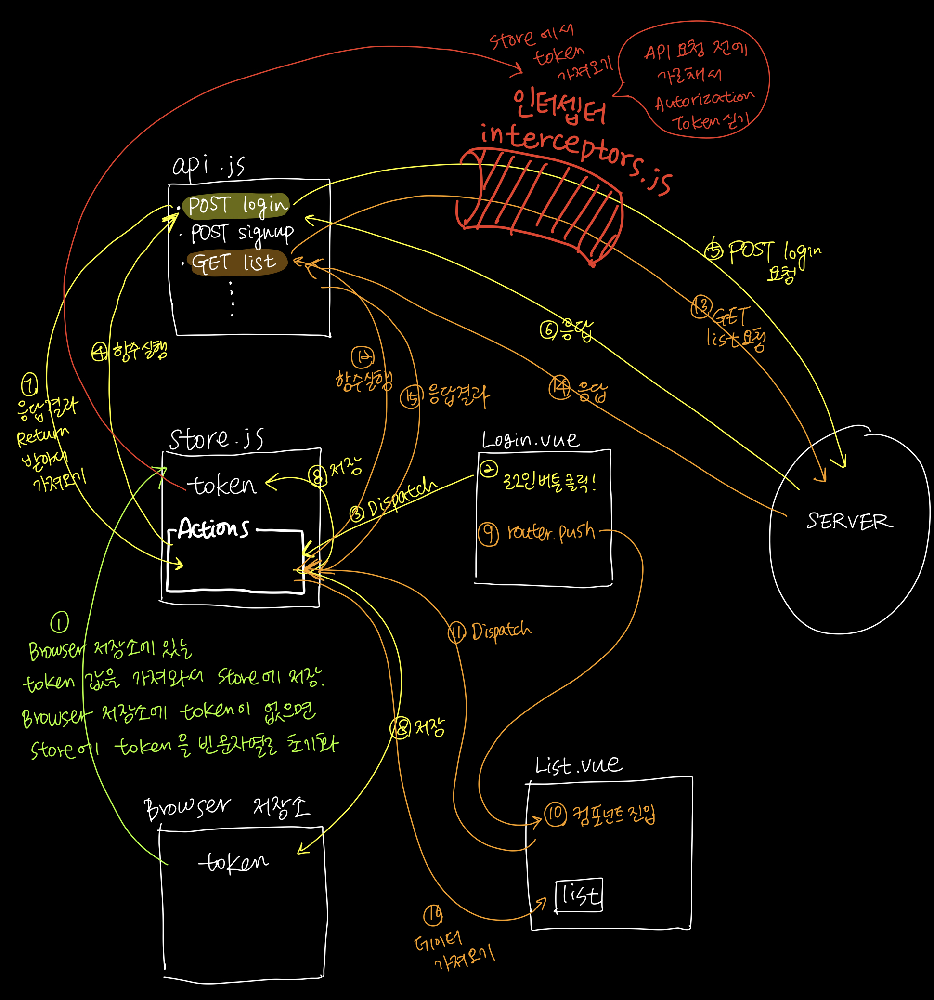

이 글은 장기효(캡틴판교)님의 [Vue.js 끝장내기 - 실무에 필요한 모든 것](https://www.inflearn.com/course/vue-js-%EB%81%9D%EB%82%B4%EA%B8%B0-%EC%BA%A1%ED%8B%B4%ED%8C%90%EA%B5%90/dashboard) 강좌를 듣고 공부하면서 필요한 부분을 정리한 글이다.


# 0. Index
1. [프로젝트 생성 및 환경 구성](#1-프로젝트-생성-및-환경-구성)
2. [Router & 컴포넌트 설계](#2-router--컴포넌트-설계)
3. [Axios 통신](#3-axios-통신)
4. [env 설정](#4-env-설정)
5. [네트워크 에러 처리](#5-네트워크-에러-처리)
6. [Validation](#6-validation)
7. [상태 관리와 Store](#7-상태-관리와-store)
8. [Token을 이용한 API 인증](#8-token을-이용한-api-인증)
9. [브라우저 저장소를 이용한 인증 값 관리](#9-브라우저-저장소를-이용한-인증-값-관리)
10. [API 함수 모듈화](#10-api-함수-모듈화)
11. [Filters - 데이터 포맷팅](#11-filters---데이터-포맷팅)
12. [Router 심화](#12-router-심화)
13. [FE Testing](#13-fe-testing)


# 1. 프로젝트 생성 및 환경 구성

### 1-1. Vue CLI로 프로젝트 생성
- vue-cli 설치 및 Vue SPA Application 생성

    ```bash
    $ npm i -g @vue/cli
    $ vue create {project_name}
    ```

    - Please pick a preset → Manually select features 선택
    - Babel, Linter / Formatter, Unit Testing 선택
    - ESLint + Prettier 선택
    - Lint on save 선택
    - Jest 선택
    - In dedicated config files 선택

<br>

### 1-2. ESLint 설정

- ESLint 란?
    - JS 코드에서 발견된 문제 패턴을 식별하기위한 정적 코드 분석 도구이다.
    - 사용자 정의된 규칙을 정의하고 로드할 수 있다.
- 에러가 화면에 표시되지 않게 하는 방법
    - ESLint는 JS 를 작성할 때 에러가 나지 않는 코드를 작성할 수 있게 "도와주는" 도구이고, ESLint 에러가 애플리케이션 실행에 방해가 되는 것은 아니기 때문에 에러가 화면에 오버레이되어 표시되지 않도록 설정하자.
    - vue.config.js 파일을 루트에 생성한다. vue 설정 파일이다.
    - vue.config.js

        ```js
        module.exports = {
            devServer: {
                overlay: false
            }
        }
        ```

- .eslintrc.js
    - root, env, extends, rules 등등.. 여러가지 옵션들이 들어가 있다.

<br>

### 1-3. Prettier 소개 및 적용
- Prettier
    - 코드 정리 도구
    - 특정 사람의 기준으로 코드를 정리하는 것이 아니라 여러 사람이 하나의 기준을 만들어서 코드를 정리할 수 있도록 도와준다.
    - Prettier 설정 내용은 .eslintrc.js 의 `rules: { ... }` 부분에 정의한다.
    - .eslintrc.js

        ```js
        module.exports = {
            ...
            rules: {
                ...
                "prettier/prettier": ['error', {
                    singleQuote: true,
                    semi: true,
                    useTabs: true,
                    tabWidth: 2,
                    trailingComma: 'all',
                    printWidth: 80,
                    bracketSpacing: true,
                    arrowParens: 'avoid',
                }]
            },
            ...
        }
        ```

- Reference
    - [Vue.js 개발 생산성을 높여주는 도구 3가지](https://joshua1988.github.io/web-development/vuejs/boost-productivity/)

<br>

### 1-4. 파일을 절대 경로로 찾기 설정

- 파일 위치의 레벨이 깊어질수록 파일을 거슬러 올라가는 코드가 붙게된다. '`../../../`'
- webpack의 resolve 옵션인 '`@/`'로 접근할 수 있게 처리하자.
- (VSCode IDE를 사용하는 경우) 프로젝트 루트 경로에 jsconfig.json 파일 생성
    - jsconfig.json
        ```json
        {
          "compilerOptions": {
            "baseUrl": ".",
            "paths": {
              "~/*": [
                "./*"
              ],
              "@/*": [
                "./src/*"
              ],
            }
          },
          "exclude": [
            "node_modules",
            "dist"
          ]
        }
        ```

<br>

### 1-5. 뷰 스타일 가이드

- [Style Guide - Vue.js](https://kr.vuejs.org/v2/style-guide/index.html)
    - 우선순위 A 규칙과 우선순위 B 규칙을 살펴보는 것을 추천한다.

<br>


# 2. Router & 컴포넌트 설계

### 2-1. Vue Router 설치 및 연결
- src/router/index.js

    ```js
    import Vue from 'vue';
    import VueRouter from 'vue-router';

    // 플러그인을 실행하기 위해서 필요한 코드
    Vue.use(VueRouter);

    // VueRouter로 인스턴스를 생성하고 export default 로 꺼냄.
    export default new VueRouter();
    ```

- src/main.js - 인스턴스 라우터를 연결해줌

    ```js
    ...
    import router from '@/router/index';
    ...
    new Vue({
        ...
        router,
    }).$mount('#app');
    ```

<br>

### 2-2. 페이지 컴포넌트 연결
- src/router/index.js

    ```js
    ...
    import LoginPage from '@/view/LoginPage.vue';
    import SignupPage from '@/view/SignupPage.vue';
    ...
    export default new VueRouter({
        // routes: Vue Router에 의해서 컨트롤되는 페이지의 정보를 담는 것 
        routes: [
            {
                path: '/login',
                component: LoginPage,
            },
            {
                path: '/signup',
                component: SignupPage,
            },
        ]
    });
    ```

<br>

### 2-3. 코드 스플리팅 소개 및 적용
- login페이지와 signup페이지 두 가지가 존재할 때 라우트 변경으로 현재 페이지가 변경되더라도 개발자 도구의 Network 탭에는 아무런 변화가 없다. SPA(Single Page Application)이기 때문.
- 최초 사이트에 접속할 때 Network 탭을 보면 app.js 의 Response 를 보면 login페이지와 signup 페이지 정보가 webpack으로 빌드된 결과물로 존재한다.
- 결론적으로 app.js 안에 모든 페이지의 정보가 들어가 있다는 것이다.
- 실제 현업 프로젝트에는 화면의 개수가 엄청나게 많다. 그 많은 페이지들을 처음에 한 번에 다 로딩해오는 것은 많은 시간이 소요된다.
- 따라서 처음 페이지가 login 페이지이라면 최초에는 login 페이지만 먼저 들고오고, 나머지 페이지들은 해당 url로 이동했을 때만 들고 오게 하는 것이 코드 스플리팅의 역할이다.
- src/router/index.js

    ```js
    ...
    routes: [
            {
                path: '/login',
                component: () => import ('@/views/LoginPage.vue'),
            },
            {
                path: '/signup',
                component: () => import ('@/views/SignupPage.vue'),
            },
        ]
    ...
    ```

    - component의 LoginPage를 바로 넣는 게 아니라 화살표함수를 이용해서 코드 스플리팅을 한다.
    - 이렇게 하면 최초에 모든 파일을 다 들고오지 않고 해당 url 로 이동했을 때 필요한 JS 파일을 그 때 그 때 들고 오게 된다. (다이나믹 임포트)
    
<br>

### 2-4. 초기 진입 페이지 설정
- 리다이렉트를 통해 초기 진입 페이지를 설정할 수 있다.
- src/router/index.js

    ```js
    ...
    routes: [
            {
                path: '/',
                redirect: '/login',
            },
            {
                path: '/login',
                component: () => import ('@/views/LoginPage.vue'),
            },
            {
                path: '/signup',
                component: () => import ('@/views/SignupPage.vue'),
            },
        ]
    ...
    ```

    - 루트 페이지에 진입하면 로그인 페이지로 리다이렉트된다.

<br>

### 2-5. 없는 페이지를 접근할 때의 라우터 처리
- 정의되어 있지 않은 모든 url에 대해서 반응하기 위한 정의

    ```js
    ...
    routes: [
            ...
            {
                path: '*',
                component: () => import ('@/views/NotFoundPage.vue'),
            },
        ]
    ...
    ```

<br>

### 2-6. history mode 설정 및 싱글 페이지 애플리케이션 배포할 때 주의 사항

```js
...
export default new VueRouter({
    mode: 'history',
    routes: [
    ...
    ]
});
```

- `mode: 'history'`를 추가하면 url `#` 제거됨
- 기본적으로 url 에 `#`이 붙어있는 이유 (해시 모드)
    - 해시 모드에서는 URL 해시를 사용하여 전체 URL을 시뮬레이트하므로 URL이 변경될 때 페이지가 다시 로드 되지 않는다.
    - 해시 모드가 아닌 히스토리 모드에서 서버는 이 페이지가 새로운 페이지라는 것을 알지 못한다. 예를 들어, 로그인 링크를 클릭했을 때 url이 이동을 하더라도 서버 입장에서는 모른다.
    - 따라서 히스토리 모드에서는 우리의 앱이 적절한 서버 설정이 없는 단일 페이지 클라이언트 앱이기 때문에 사용자가 직접 [http://oursite.com/login](http://oursite.com/user/id) 에 접속하면 404 오류가 발생한다.
    - 그래서 기본적으로 해시 모드인 것이다.
- 히스토리 모드에서 정상적으로 사용하기 위해서는 서버에 간단하게 포괄적인 대체 경로를 추가해야 한다. URL이 정적 에셋과 일치하지 않으면 앱이 있는 동일한 index.html페이지를 제공해야 한다.
- Reference
    - [HTML5 히스토리 모드 | Vue Router](https://router.vuejs.org/kr/guide/essentials/history-mode.html)

<br>

# 3. Axios 통신

### 3-1. Axios 설정 및 API 폴더 구조화
- Axios 설치

    ```bash
    $ npm i axios
    ```

- Axios로 통신하는 방법
    - 방법 1 : axios 요청을 날리는 Vue 컴포넌트에 직접 axios를 import하여 작성한다
        - components/SignupForm.vue
            ```js
            <script>
                import axios from 'axios';
    
                export default {
                  ...
                    methods: {
                        submitForm() {
                            console.log('폼 제출');
                            axios.post();
                        }
                    },
                }
            </script>
            ```

    - 방법 2 : API 구조화 (추천)
        - src/api 폴더 생성
        - src/api/index.js 파일 생성

            ```js
            import axios from 'axios';

            function registerUser(userData) {
              const url = 'http://localhost:3000/signup';
              return axios.post(url, userData);
            }

            export { registerUser };
            ```

            - export된 `registerUser` 함수를 Vue 컴포넌트에서 import 해와서 호출할 수 있게 된다.
            - `axios.post()` 결과가 Promise 이기 때문에 Promise 를 return을 해줘야 `registerUser`를 호출한 이후의 비동기 동작을 수행할 수 있게 된다.
        - components/SignupForm.vue

            ```js
            <script>
                import { registerUser } from '@/api/index';

                export default {
                  ...
                    methods: {
                        submitForm() {
                            console.log('폼 제출');
                            const userData = {
                                username: this.username,
                                password: this.password,
                                nickname: this.nickname
                            }
                            registerUser(userData);
                        }
                    },
                }
            </script>
            ```

- 비동기 처리
    - 회원 가입이 완료되고 나서 일어나는 부가적인 동작들을 위해서 `submitForm` 을 비동기 처리해줘야 한다.
    - `registerUser` 함수 호출 결과, Promise가 resolve 된 형태로 들어오게 된다.

    ```js
    <script>
        import { registerUser } from '@/api/index';

        export default {
          ...
            methods: {
                async submitForm() {
                    console.log('폼 제출');
                    const userData = {
                        username: this.username,
                        password: this.password,
                        nickname: this.nickname
                    }
                    const { data } = await registerUser(userData);
                    console.log(data.username);
                    this.initForm();
                },
                initForm() {
                    this.username = '';
                    this.password = '';
                    this.nickname = '';
                }
            },
        }
    </script>
    ```
  
<br>

### 3-2. API 설정 공통화
- url 공통화 - src/api/index.js

    ```js
    import axios from 'axios';

    const axiosService = axios.create({
     baseURL: 'http://localhost:3000/',
    });

    function registerUser(userData) {
      return axiosService.post('signup', userData);
    }

    export { registerUser };
    ```

    - `axios.create()` 라고 하는 axios의 api를 이용하여 인스턴스를 생성한다. API 요청할 때 필요한 공통 설정을 미리 넣을 수 있다.

<br>

# 4. env 설정

### 4-1. env 파일과 설정 방법
- 프로젝트 루트 경로에 `.env` 파일을 생성한다.
- 예전 Vue 버전 환경에서는 루트 경로가 아닌 `{root}/config/dev.env.js` 와 같이 생성해야 한다.
In old Vue versions environment variables were defined in e.g. config/dev.env.js instead of the .env files in root
- .env 파일은 키 = 값 형태로 정의할 수 있는 환경 변수 파일이다.
- .env

    ```
    VUE_APP_API_URL=http://localhost:3030/
    ```

    - 앞에 `VUE_APP_` 을 꼭 포함시켜야 한다.
    - `VUE_APP_` 가 포함된 환경변수는 아래의 파일에서 따로 import 하지 않아도 자동으로 쓸 수 있게 해준다.
- src/api/index.js

    ```js
    import axios from 'axios';

    const axiosService = axios.create({
      baseURL: process.env.VUE_APP_API_URL,
    });

    function registerUser(userData) {
      return axiosService.post('signup', userData);
    }

    export { registerUser };
    ```

<br>

### 4-2. Vue CLI의 env 파일 규칙과 실무 환경 구성 방법
- 개발 모드와 배포 모드를 구분하여 환경을 구성해야 한다.
- `.env.development` 파일을 새로 생성한다. 이 파일은 개발 모드에서만 동작한다.
- `.env` 파일은 우선순위가 낮다. 그래서 개발 모드에서는 `.env.development` 파일이 우선순위가 높아서 이 파일에 있는 환경 변수를 가져온다. 이 파일에 값이 없으면 `.env` 파일에 있는 값을 찾는다.
- `.env` 파일은 `.env.development` 와 `.env.production` 파일에 없는 공통의 값을 지정하기 위해 사용한다.
- `.env.production` 파일을 만들 수 있는데 이 파일은 배포 모드에서만 동작한다.
- vue 예전 버전 : `/config/dev.env.js`, `/config/prod.env.js`
    - Example - /config/dev.env.js
        ```js
          'use strict'
          const merge = require('webpack-merge')
          const prodEnv = require('./prod.env')
          
          module.exports = merge(prodEnv, {
            NODE_ENV: '"development"',
            VUE_APP_API_URL:'"http://localhost:3030/"',
          })
        ```

<br>

# 5. 네트워크 에러 처리

### 5-1. 네트워크 에러 확인 방법과 에러 처리 코드 구현
- try-catch 문으로 네트워크 에러를 처리한다.
- components/signupForm.vue

    ```js
    <script>
        import { registerUser } from '@/api/index';

        export default {
          ...
            methods: {
                async submitForm() {
                    try {
                        // 비즈니스 로직
                        const userData = {
                            username: this.username,
                            password: this.password,
                            nickname: this.nickname
                        }
                        const { data } = await registerUser(userData);
                        this.logMessage = `${data.user.username}님 회원 가입이 완료되었습니다.`;
                    } catch (error) {
                        // 에러 핸들링할 코드
                        console.log(error.response);
                        this.logMessage = error.response.data;
                    } finally {
                        this.initForm();
                    }
                },
                ...
            },
        }
    </script>
    ```

    - try 문 안에 있는 로직을 처리하다가 발생하는 에러들에 대해서는 무조건 다 catch 문 안에 error 객체로 담겨서 들어오게 된다.
    - finally 문은 무조건 실행된다.

<br>

# 6. Validation

### 6-1. Form Input 유효성(validation) 검사
- ID 입력창에 이메일 형식으로 입력하지 않았거나 입력창에 입력값이 없을 경우 회원가입 버튼 비활성화
    - 이메일 형식 validation을 확인하는 기능은 여러군데에서 사용할 수 있으니 src/utils 폴더 생성해서 validation.js 파일을 생성한다.
    - src/utils/validation.js

        ```js
        function validateEmail(email) {
            const re = /^(([^<>()[\]\\.,;:\s@"]+(\.[^<>()[\]\\.,;:\s@"]+)*)|(".+"))@((\[[0-9]{1,3}\.[0-9]{1,3}\.[0-9]{1,3}\.[0-9]{1,3}\])|(([a-zA-Z\-0-9]+\.)+[a-zA-Z]{2,}))$/;
            return re.test(String(email).toLowerCase());
        }

        export { validateEmail };
        ```

    - components/signupForm.vue

        ```js
        <template>
            <form>
                ...
                <button :disabled="!isUsernameValid || !password" type="submit">회원가입</button>
            </form>
        </template>
        <script>
            ...
            import { validateEmail } from '@utils/validation';

            export default {
                ...
                computed: {
                    isUsernameValid() {
                        return validateEmail(this.username);
                    }
                },
                ...
            }
        </script>
        ```

        - computed 를 활용한다.
        - `this.username` 이 한 글자 한 글자 바뀔 때마다 `validateEmail` 이라는 함수가 실행이 될 것이다.

<br>

# 7. 상태 관리와 Store

### 7-1. Store
- 컴포넌트끼리 데이터를 공유하고 싶을 때 props, event bus 를 이용할 수도 있지만 가장 효율적인 방법은 Store를 이용하는 방식이다. (Vuex)
- 데이터를 Store에 담아놓으면 어떤 컴포넌트든 이 Store에 담긴 데이터를 꺼내서 사용할 수 있다.

<br>

### 7-2. Vuex 설치 및 연결
- 설치
    ```bash
    $ npm i vuex
    ```

- vuex는 package.json의 dependencies에  들어가게 된다.
    - `dependencies` : 프로젝트를 빌드하면 최종적으로 자원이 압축이 되어 함께 나가게 된다.
    - `devDependencies` : 빌드 결과물에 포함되지 않는다.

<br>

### 7-3. State, Mutations
- src/store 폴더 생성
- src/store/index.js 파일 생성

    ```js
    import Vue from 'vue';
    import Vuex from 'vuex';

    Vue.use(Vuex);

    export default new Vuex.Store({
        state: {
            username: '',
        },
        mutations: {
            setUsername(state, username) {
                state.username = username;
            }
        }
    });
    ```

    - 로그인한 사용자의 정보를 Store에 담기 위해서 `state`에 추가해준다.
    - `state` : 여러 컴포넌트에서 공유되는 데이터
    - `mutations` : 데이터(state)를 변경하는 것
        - 위의 코드에서는 `username`을 받아서 `state.username`에 넣는다.
- src/main.js

    ```js
    ...
    import store from '@/store/index';

    new Vue({
        ...
        store,
    }).$mount('#app');
    ```

- LoginForm.vue

    ```js
    <script>
        ...

        export default {
          ...
            methods: {
                ...
                async submitForm() {
                    const userData = {
                        username: this.username,
                        password: this.password,
                    }
                    const { data } = await loginUser(userData);
                    this.$store.commit('setUsername', data.user.username);
                    this.$router.push('/main');
                    ...
                },
                ...
            },
        }
    </script>
    ```

    - `this.$store.commit('setUsername', data.user.username)` : mutations를 호출하여 Store의 state 데이터 값을 변경한다.
- Header.vue

    ```js
    <template>
        ...
        <span>{{ $store.state.username }}</span>
    </template>
    ```

    - `$store.state.username` : Store의 state 데이터 중 `username` 값을 가져와서 출력할 수 있다.
    
<br>

### 7-4. Getters
- Getters : state의 값이 변경됐을 때 특정 상태를 계산할 수 있게 해준다.
- Getters는 Vue의  computed와 비슷하다.
- 로그인 유무 판별 : state username 값이 빈 문자열이 아니면 로그인 되어 있는 상태로 판별할 수 있다.
- store/index.js

    ```js
    import Vue from 'vue';
    import Vuex from 'vuex';

    Vue.use(Vuex);

    export default new Vuex.Store({
        state: {
            username: '',
        },
        getters: {
            isLogin(state) {
                return state.username !== '';
            },
        },
        mutations: {
            setUsername(state, username) {
                state.username = username;
            }
        }
    });
    ```

- Getters 값 사용하기
    - 방법 1

        ```js
        <template>
            ...
            <template v-if="$store.getters.isLogin">
                <span>{{ $store.state.username }}</span>
            </template>
            <template>
                <router-link to="/login">로그인</router-link>
            </template>
        </template>
        ```

        - `<template>`으로 분기처리할 수 있다.
        - `$store.getters.isLogin` : Store의 Getters에 직접 접근할 수 있다.
    - 방법 2

        ```js
        <template>
            ...
            <template v-if="isUserLogin">
                <span>{{ $store.state.username }}</span>
            </template>
            <template>
                <router-link to="/login">로그인</router-link>
            </template>
        </template>
        <script>
            export default {
                computed: {
                    isUserLogin() {
                        return this.$store.getters.isLogin;
                    }
                }
            }
        </script>
        ```

        - template 표현식을 최대한 간결하게 하기 위해서 computed를 이용한다. (추천)

<br>

# 8. Token을 이용한 API 인증

### 8-1. Token
- Token은 로그인 이후의 API에 대해서 필요한 인증값이다.
- POST Login API 호출 시 서버로부터 Token 값을 받아올 수 있다.
- Token은 사용자 인증이 완료 되었을 때만 발급된다.

<br>

### 8-2. HTTP 헤더에 토큰 값 싣는 방법
- src/api/index.js

    ```js
    import axios from 'axios';

    const axiosService = axios.create({
      baseURL: process.env.VUE_APP_API_URL,
      headers: {
        Authorization: 'token_test',
      }
    });

    function registerUser(userData) {
      return axiosService.post('signup', userData);
    }
    ...

    export { registerUser };
    ```

    - axiosService 라는 인스턴스 headers Authorization 에 token 값을 설정할 수 있다.
- LoginForm.vue 컴포넌트에서 login API 호출로 받아온 token 값을 api/index.js 에 넘겨야 한다. → Store 를 이용하는 것을 추천!
- store/index.js

    ```js
    ...
    export default new Vuex.Store({
        state: {
            ...
            token: '',
        },
        ...
        mutations: {
            ...
            setToken(state, token) {
                state.token = token;
            }
        }
    });
    ```

- LoginForm.vue

    ```js
    ...
    <script>
        ...
        methods: {
            async submitForm() {
                try {
                    ...
                    const { data } = await loginUser(userData);
                    this.$store.commit('setToken', data.token);
                    ...
                } catch (error) {
                    ...
                } finally {
                    ...
                }
            }
        }
    </script>
    ```

- src/api/index.js

    ```js
    import axios from 'axios';
    import store from '@/store/index';

    const axiosService = axios.create({
      baseURL: process.env.VUE_APP_API_URL,
        headers: {
            Authorization: store.state.token,
        }
    });

    function registerUser(userData) {
      return axiosService.post('signup', userData);
    }
    ...

    export { registerUser };
    ```

    - axiosService 인스턴스에 store에 있는 token 값 설정해준다.
    
<br>

### 8-3. Axios 인터셉터 사용하기
- 현재 로직
    - src/api/index.js

        ```js
        import axios from 'axios';
        import store from '@/store/index';

        const axiosService = axios.create({
          baseURL: process.env.VUE_APP_API_URL,
            headers: {
                Authorization: store.state.token,
            }
        });

        function loginUser(userData) {
          return axiosService.post('login', userData);
        }
        ...

        export { loginUser };
        ```

        1. store에 저장되어 있는 `token` 값 (defaults: 빈 문자열) 을 `axiosService` 인스턴스에 설정
        2. POST login 요청으로 받아온 `token` 값을 store에 저장
        3. 다시 store에 저장되어 있는 `token` 값을 `axiosService` 인스턴스에 설정
- Axios Interceptors 사용해보기
    - **Axios Interceptors**: 
    You can intercept requests or responses before they are handled by `then` or `catch`.
    HTTP 요청과 응답을 컴포넌트 단에서 처리하기 전에 추가 로직을 넣을 수 있다.

        ```js
        // Add a request interceptor
        axios.interceptors.request.use(function (config) {
          // 요청을 보내기 전에 어떤 처리를 할 수 있다.
          return config;
        }, function (error) {
          // 요청이 잘못되었을 때 에러가 컴포넌트 단으로 오기 전에 어떤 처리를 할 수 있다.
          return Promise.reject(error);
        });
    
        // Add a response interceptor
        axios.interceptors.response.use(function (response) {
          // 서버에 요청을 보내고 나서 응답을 받기 전에 어떤 처리를 할 수 있다.
          return response;
        }, function (error) {
          // 응답이 에러인 경우에 미리 전처리할 수 있다.
          return Promise.reject(error);
        });
        ```

<br>

### 8-4. Axios 인터셉터 모듈화 및 연결
- src/api/common 폴더 생성
- src/api/common/interceptors.js 파일 생성

    ```js
    export function setInterceptors(axiosService) {
        axiosService.interceptors.request.use(function (config) {
          // 요청을 보내기 전에 어떤 처리를 할 수 있다.
          return config;
        }, function (error) {
          // 요청이 잘못되었을 때 에러가 컴포넌트 단으로 오기 전에 어떤 처리를 할 수 있다.
          return Promise.reject(error);
        });
        
        axiosService.interceptors.response.use(function (response) {
          // 서버에 요청을 보내고 나서 응답을 받기 전에 어떤 처리를 할 수 있다.
          return response;
        }, function (error) {
          // 응답이 에러인 경우에 미리 전처리할 수 있다.
          return Promise.reject(error);
        });

        return axiosService;
    }
    ```

- src/api/index.js

    ```js
    import axios from 'axios';
    import store from '@/store/index';
    import { setInterceptors } from './common/interceptors';

    function createAxiosService() {
        const axiosService = axios.create({
          baseURL: process.env.VUE_APP_API_URL,
            headers: {
                Authorization: store.state.token,
            }
        });
        
      return setInterceptors(axiosService);
    }

    const axiosService = createAxiosService();

    function loginUser(userData) {
      return axiosService.post('login', userData);
    }
    ...

    export { loginUser };
    ```

    - setInterceptors 함수 import
    - axiosService 인스턴스에 setInterceptors 함수 연결
    
<br>

### 8-5. Axios 인터셉터로 Token 설정
> 인터셉터를 사용하는 것은 필수는 아니다. api/index.js에서 Axios 인스턴스를 만들 때 Authorization에 token 값을 설정해줘도 된다.

- 먼저 api/index.js 의 token 설정 부분을 제거한다.
    - src/api/index.js

        ```js
        import axios from 'axios';
        import { setInterceptors } from './common/interceptors';

        function createAxiosService() {
            const axiosService = axios.create({
              baseURL: process.env.VUE_APP_API_URL,
            });
            
          return setInterceptors(axiosService);
        }

        const axiosService = createAxiosService();

        function loginUser(userData) {
          return axiosService.post('login', userData);
        }
        ...

        export { loginUser };
        ```

- inspectors 설정 파일에 store 를 import해주고 요청을 보내기 직전에 `config.headers.Authorization` 에 token 값을 넣어준다.
    - src/api/common/interceptors.js

        ```js
        import store from '@/store/index';

        export function setInterceptors(axiosService) {
            axiosService.interceptors.request.use(
                function (config) {
                  config.headers.Authorization = store.state.token;
                  return config;
                },
                function (error) {
                  return Promise.reject(error);
                }
          );
            
          axiosService.interceptors.response.use(
            function (response) {
                  return response;
                },
              function (error) {
                  return Promise.reject(error);
                }
            );

            return axiosService;
        }
        ```

- 일단 여기까지 최종 로그인 로직 (추후에 브라우저 저장소를 이용하는 로직을 추가하며 약간 변경될 예정임)
    1. 로그인 API 요청 및 성공
    2. 로그인 API의 응답으로 받은 토큰을 스토어에 저장
    3. 인터셉터에 정의된 코드가 매 API 요청마다 스토어에서 토큰을 꺼내 Authorization 속성에 연결

<br>

# 9. 브라우저 저장소를 이용한 인증 값 관리

### 9-1. 화면 새로고침 했을 때의 문제점 분석
- Token을 자바스크립트 레벨(Vuex Store)에 저장하면 새로고침 했을 때 저장되어 있던 Token값이 사라진다.
- 그래서 다른 HTTP 요청을 할 때 Token 값이 Store 에 존재하지 않기 때문에 Authorization 이 빈 문자열로 요청을 하게 되어 401 에러가 발생한다.
- Cookies 를 이용하여 해결할 수 있다.

<br>

### 9-2. Cookies를 이용하여 해결
- /src/utils/cookies.js 생성

    ```js
    function saveAuthToCookie(value) {
      document.cookie = `auth=${value}`;
    }

    function saveUserToCookie(value) {
      document.cookie = `user=${value}`;
    }

    function getAuthFromCookie() {
      return document.cookie.replace(
        /(?:(?:^|.*;\s*)auth\s*=\s*([^;]*).*$)|^.*$/,
        '$1',
      );
    }

    function getUserFromCookie() {
      return document.cookie.replace(
        /(?:(?:^|.*;\s*)user\s*=\s*([^;]*).*$)|^.*$/,
        '$1',
      );
    }

    function deleteCookie(value) {
      document.cookie = `${value}=; expires=Thu, 01 Jan 1970 00:00:01 GMT;`;
    }

    export {
      saveAuthToCookie,
      saveUserToCookie,
      getAuthFromCookie,
      getUserFromCookie,
      deleteCookie,
    };
    ```

- LoginForm.vue

    ```js
    <script>
        ...
        import { saveAuthToCookie, saveUserToCookie } from '@/utils/cookies';

        export default {
            ...
            methods: {
                async submitForm() {
                    try {
                        ...
                        const { data } = await loginUser(userData);
                        this.$store.commit('setToken', data.token);
                        this.$store.commit('setUsername', data.user.username);
                        saveAuthToCookie(data.token);
                        saveUserToCookie(data.user.username);
                        this.$router.push('/main');
                    } catch (error) {
                        ...
                    } finally {
                        ...
                    }
                }
            }
        }
    </script>
    ```

    - POST login 후 서버로 부터 가져오는 `token` 값과 `user.username`  값을 Cookies 에 저장
- store/index.js

    ```js
    ...
    import { getAuthFromCookie, getUserFromCookie } from '@/utils/cookies';
    ...
    export default new Vuex.Store({
        state: {
            username: getUserFromCookie() || '',
            token: getAuthFromCookie() || '',
        },
        getters: {
          ...
        },
        mutations: {
            ...
        },
    });

    ```

    - Cookies 에 저장되어 있는 값이 있으면 가져와서 Store 에 저장하고, 그렇지 않으면 빈 문자열로 저장한다.
    - 페이지를 새로고침 하더라도 Cookies 에 있는 값으로 Store의 token 에 다시 저장하기 때문에 API 요청시 문제 없이 동작하게 된다.

<br>

### 9-3. Store Actions 속성을 이용해서 리팩토링
- Actions 는 비동기 처리를 위한 것이다.
- LoginForm.vue 컴포넌트에 로그인 이후 처리에 대한 비즈니스 로직이 너무 많이 포함되어 있다.
- 컴포넌트단의 코드를 최대한 깔끔하게 하기 위해서 Vuex Store의 Actions 속성을 이용할 수 있다.
- store/index.js

    ```js

    import { saveAuthToCookie, saveUserToCookie } from '@/utils/cookies';
    import { loginUser } from '@/api/index';
    ...
    actions: {
        async LOGIN({ commit }, userData) {
            const { data } = await loginUser(userData); // api 호출
            commit('setToken', data.token);
            commit('setUsername', data.user.username);
            saveAuthToCookie(data.token);
            saveUserToCookie(data.user.username);
            return data;
        }
    }
    ```

    - 필요한 데이터를 나중에 활용할 수도 있는 측면에서 마지막 줄에 `return data`를 해준다.
- loginForm.vue

    ```js
    <script>
        ...
        
        export default {
            ...
            methods: {
                async submitForm() {
                    try {
                        ...
                        // const { data } = await loginUser(userData);
                        // this.$store.commit('setToken', data.token);
                        // this.$store.commit('setUsername', data.user.username);
                        // saveAuthToCookie(data.token);
                        // saveUserToCookie(data.user.username);
                        await this.$store.dispatch('LOGIN', userData);
                        this.$router.push('/main');
                    } catch (error) {
                        ...
                    } finally {
                        ...
                    }
                }
            }
        }
    </script>
    ```

    - dispatch 를 이용하면 Store Actions 를 호출할 수 있다.
    - Actions 처리(API 호출이 끝나고 store와 cookies에 token 저장하는 등)가 끝나고 나서 '/main' 페이지로 이동해야 하기 때문에 dispatch할 때 await 를 넣어줘야 한다.

<br>

### 9-4. 최종 로직
- gif
    
- png
     

<br>

# 10. API 함수 모듈화

### 10-1. API 함수 모듈화의 필요성
- api/index.js 하나의 파일에서 모든 api를 관리하는 것보다 관련 기능끼리 묶어서 모듈화하는 것이 좋다.

<br>

### 10-2. 인스턴스 생성 함수 분할
- /api/index.js 기존 코드

    ```js
    import axios from 'axios';
    import { setInterceptors } from './common/interceptors';

    function createAxiosService() {
        const axiosService = axios.create({
          baseURL: process.env.VUE_APP_API_URL,
        });
        
      return setInterceptors(axiosService);
    }

    const axiosService = createAxiosService();

    function registerUser(userData) {
        return axiosService.post('signup', userData);
    }

    function loginUser(userData) {
      return axiosService.post('login', userData);
    }

    function fetchPosts() {
        return instance.get('posts');
    }

    ...

    export { registerUser, loginUser, fetchPosts, ... };
    ```

    - 모든 API 요청에 인터셉터로 token 값 실어서 보내고 있다.
    - 따라서 Authorization 값이 필요없는 `registerUser`, `loginUser` 와 같은 로그인 이전 단계의 요청들에도 token 값이 같이 들어갈 수 있게 된다. 백엔드에서 엄격하게 코드를 짰다면 이 부분에서 에러가 날 것이다.
    - 이런 부분을 위해서 함수를 두 개로 분리해보자.
- /api/index.js 함수를 두 개로 분리한 코드

    ```js
    import axios from 'axios';
    import { setInterceptors } from './common/interceptors';

    function createAxiosService() {
        return axios.create({
          baseURL: process.env.VUE_APP_API_URL,
        });
    }

    function createAxiosServiceWithAuth(url) {
        const axiosService = axios.create({
          baseURL: `${process.env.VUE_APP_API_URL}/${url}`,
        });
        
      return setInterceptors(axiosService);
    }

    const axiosService = createAxiosService();
    const posts = createAxiosServiceWithAuth('posts');

    function registerUser(userData) {
        return axiosService.post('signup', userData);
    }

    ...

    export { registerUser, loginUser, fetchPosts, ... };
    ```

    - `createAxiosService` : 인증값이 필요없는 요청이 일어날 때
    - `createAxiosServiceWithAuth` : 인증값이 필요한 요청이 일어날 때
        - `url`을 매개변수로 받아와서 `baseURL` 을 설정해준다. (restful api)
        
<br>

### 10-3. 관련 API 기능별 파일 분할
- src/api/auth.js 파일 생성 - 로그인, 회원가입 등 계정과 관련된 API

    ```js
    import { axiosService } from './index';

    function registerUser(userData) {
        return axiosService.post('signup', userData);
    }

    function loginUser(userData) {
      return axiosService.post('login', userData);
    }

    export { registerUser, loginUser };
    ```

- src/api/posts.js 파일 생성 - posts 와 관련된 API

    ```js
    import { posts } from './index';

    function fetchPosts() {
        return posts.get('/');
    }

    function createPosts(postData) {
        return posts.post('/', postData);
    }

    export { fetchPosts, createPosts };
    ```

- src/api/index.js

    ```js
    import axios from 'axios';
    import { setInterceptors } from './common/interceptors';

    function createAxiosService() {
        return axios.create({
          baseURL: process.env.VUE_APP_API_URL,
        });
    }

    function createAxiosServiceWithAuth(url) {
        const axiosService = axios.create({
          baseURL: `${process.env.VUE_APP_API_URL}/${url}`,
        });
        
      return setInterceptors(axiosService);
    }

    export const axiosService = createAxiosService();
    export const posts = createAxiosServiceWithAuth('posts');
    ```

    - 인스턴스를 분리된 파일에서 사용할 수 있도록 export 해준다.
    - api/index.js 파일은 이제 setup 과 관련된 코드만 남게된다.

# 11. Filters - 데이터 포맷팅

### 11-1. Vue Filters
- `{{ message | capitalize }}` 필터 함수 이름을 우측에 넣어주면 데이터를 필터링한 결과를 화면에 보여준다.
- Vue filters 정의

    ```js
    <script>
      ...
        filters: {
            capitalize() {
                if (!value) return '';
                value = value.toString();
                return value.charAt(0).toUpperCase() + value.slice(1);
            }
        }
    </script>
    ```

- Reference
    - [필터 - Vue.js](https://kr.vuejs.org/v2/guide/filters.html)

<br>

### 11-2. Filters 적용
- Date 형식 정의하는 Filter

    ```js
    <template>
        ...
        <span>{{ postItem.createDT | formatDate }}</span>
        ...
    </template>
    <script>
        ...
        filters: {
            formatDate(value) {
                return new Date(value);
            }
        }
        ...
    </script>
    ```

<br>

### 11-3. 전역 Filters 소개 및 설정
- 필터를 여러 컴포넌트에 적용할 수 있는 형태로 재사용 가능하게 하는 방법
    - utils/filters.js 파일 생성

        ```js
        export function formatDate(value) {
          const date = new Date(value);
          const year = date.getFullYear();
          let month = date.getMonth() + 1;
          month = month > 9 ? month : `0${month}`;
          const day = date.getDate();
          let hours = date.getHours();
          hours = hours > 9 ? hours : `0${hours}`;
          const minutes = date.getMinutes();
          return `${year}-${month}-${day} ${hours}:${minutes}`;
        }
        ```

    - main.js

        ```js
        ...
        import { formatDate } from '@/utils/filters';

        Vue.filter('formatDate', formatDate);
        ...
        ```

        - 전역 필터는 Vue.filter를 이용해서

<br>

# 12. Router 심화

### 12-1. Dynamic Route Matching
- 라우터에 path를 정의할 때 id를 파라미터로 받아서 해당 페이지로 진입했을 때 id 로 접근할 수 있는 형태
- router/index.js

    ```js
    ...
    {
        path: '/post/:id',
        component: () => import('@/views/PostEditPage.vue');
    }
    ...
    ```

- PostListItem.vue

    ```js
    ...
    methods: {
        ...
        routeEditPage() {
            const id = this.postItem.id;
            this.$router.push(`/post/${id}`);
        }
    }
    ...
    ```

<br>

### 12-2. 라우터 네비게이션 가드
- 로그인하지 않은 사용자(페이지 접근 권한이 없는 사용자)가 브라우저 주소창에 특정 url 을 입력하여 접속을 하지 못하도록 막는 것.
- router/index.js

    ```js
    import Vue from 'vue';
    import VueRouter from 'vue-router';

    Vue.use(VueRouter);

    const router = new VueRouter({
      routes: [
        {
          path: '/',
          redirect: '/login',
        },
        {
          path: '/login',
          component: () => import('@/views/LoginPage.vue'),
        },
        {
          path: '/signup',
          component: () => import('@/views/SignupPage.vue'),
        },
        {
          path: '/main',
          component: () => import('@/views/MainPage.vue'),
          meta: { auth: true },
        },
        {
          path: '/add',
          component: () => import('@/views/PostAddPage.vue'),
          meta: { auth: true },
        },
        {
          path: '/post/:id',
          component: () => import('@/views/PostEditPage.vue'),
          meta: { auth: true },
        },
        {
          path: '*',
          component: () => import('@/views/NotFoundPage.vue'),
        },
      ],
    });

    router.beforeEach((to, from, next) => {
      if (to.meta.auth && !store.getters.isLogin) {
        console.log('인증이 필요합니다');
        next('/login');
        return;
      }
      next();
    });

    export default router;
    ```

    - Route 부가 정보를 입력할 수 있는 `meta` 속성을 추가한다.
    - `new VueRouter` 인스턴스를 새로운 변수 `router` 에 담아준다.
    - `router` 변수에 `beforeEach` 를 사용한다. (라우터 네비게이션 가드)
        - `to` : 이동하려는 페이지
        - `from` : 현재 페이지
        - `next` : 다음 페이지로 이동할 수 있도록 호출하는 API
    - 위 코드에서는 라우트 이동이 일어나기 전에 페이지 접근 권한이 있는지 확인하고 있다.
        - `to.meta.auth` : 인증이 필요한 페이지인지 확인
        - `store.getters.isLogin` : 현재 로그인되어 있는 상태인지 확인
        - 페이지 접근 권한이 없을 경우 `next('/login')`으로 로그인 페이지로 이동시킨다.
        - `return;` 을 꼭 넣어줘야 한다. `next('/login')`을 하고나서 `next();` 를 또 호출하는 불필요한 현상이 발생하기 때문이다.

<br>

# 13. FE Testing

### 13-1. 테스트 코드의 필요성
- ex) 로그인 기능
    - id 인풋박스에 이메일을 입력했을 때 이메일이 맞는지 확인하는 로직
    - id, pw가 맞는 경우에 로그인 처리가 된다. 다음 페이지로 이동
- 기능을 구현하고나서 확인하기 위해서는 일일이 인풋박스에 값을 넣어봐야 한다.
- 테스트 코드를 짜게 되면 직접 값을 넣어보지 않더라도 기능이 잘 돌아가는지 검증하고 보장할 수 있다.

<br>

### 13-2. Jest 소개
- JS 테스팅 도구 사용량 통계

    [The State of JavaScript 2019: Testing](https://2019.stateofjs.com/testing/)

- Jest 공식문서

    [Getting Started · Jest](https://jestjs.io/docs/en/getting-started)

<br>

### 13-3. 테스트 파일명과 설정
- 파일명
    - `{파일명}.spec.js` 이나 `{파일명}.test.js` 으로 중간에 `spec` 이나 `test` 를 넣어줘야 한다.
- jest.config.js 파일을 생성해서 테스트 대상을 지정할 수 있다.

    ```js
    module.exports = {
        preset: '@vue/cli-plugin-unit-jest',
        testMatch: [
            '<rootDir>/src/**/*.spec.(js|js|ts|tsx)|**/__tests__/*.(js|js|ts|tsx)';
        ],
    }
    ```

    - 위와 같이 테스트 대상을 별도로 지정하지 않으면 프로젝트 루트 디렉토리의 `tests` 폴더 안에 JS 테스트 파일을 작성해야 한다. 이러한 방식은 개인의 선호도가 있겠지만 테스트 파일은 테스트할 파일과 가장 근접하게 두는 것을 추천한다.
    - `/components/__test__` 폴더를 생성해서 테스트 파일을 작성하는 방식이 있다.
- eslint에 jest 문법을 이해할 수 있도록 설정
    - .eslintrc 파일에 아래와 같이 추가

        ```js
        {
          "env": {
            "jest": true
          },
        }
        ```

<br>

### 13-4. Jest API 소개 및 테스트 해보기
- Jest에서 제공하는 API
    - `describe` : 연관된 테스트 케이스를 그룹화하는 API
    - `test` : 하나의 테스트 케이스를 검증하는 API
    - `expect` : 테스트 결과를 예상하는 API
- 테스트 작성해보기
    - math.js

        ```js
        export function sum(a, b) {
            return a + b;
        }
        ```

    - math.spec.js

        ```js
        import { sum } from './math';

        describe('math.js', () => {
            test('10 + 20 = 30', () => {
                const result = sum(10, 20);
                expect(result).toBe(30);
            });
        });
        ```

<br>

### 13-5. Vue 컴포넌트 테스트 방법
- ex) LoginForm.vue 컴포넌트 테스트
    - LoginForm.spec.js 파일 생성

        ```js
        import Vue from 'vue';
        import LoginForm from './LoginForm.vue';

        describe('LoginForm.vue', () => {
            test('컴포넌트가 마운팅되면 username이 존재하고 초기값으로 설정되어 있어야 한다.', () => {
                const instance = new Vue(LoginForm).$mount();
                expect(instance.username).toBe('');
            });
        });
        ```

        - describe : 일반적으로 그룹핑을 할 때 여러 그룹으로 나눌 수도 있지만, 기본적으로 컴포넌트 테스트 파일을 하나 만들었을 때 컴포넌트 이름을 최소 그룹 단위로 하는 것을 추천한다.
        - LoginForm 으로 Vue 인스턴스를 생성하고 그 인스턴스에 username이 존재하는지 확인한다.

<br>

### 13-6. Vue Test Utils 라이브러리 소개
- Vue Test Utils : Vue.js 를 위한 유닛테스트 공식 라이브러리
- Vue Test Utils 라이브러리를 사용하면 LoginForm.spec.js을 아래와 같이 수정할 수 있다.

    ```js
    import { shallowMount } from '@vue/test-utils';
    import LoginForm from './LoginForm.vue';

    describe('LoginForm.vue', () => {
        test('컴포넌트가 마운팅되면 username이 존재하고 초기값으로 설정되어 있어야 한다.', () => {
            const wrapper = shallowMount(LoginForm);
            expect(wrapper.vs.username).toBe('');
        });
    });
    ```

    - shallowMount(LoginForm) : LoginForm 컴포넌트가 마운팅된다.
    - wrapper.vm : 인스턴스
    
<br>

### 13-7. find()를 이용한 컴포넌트 HTML 요소 검색
- LoginForm 컴포넌트에서 테스트해야 할 기능
    1. id 인풋박스에 이메일을 입력했을 때 이메일이 맞는지 확인하는 로직
    2. pw가 맞는 경우에 로그인 처리가 된다. 다음 페이지로 이동
- LoginForm.spec.js

    ```js
    import { shallowMount } from '@vue/test-utils';
    import LoginForm from './LoginForm.vue';

    describe('LoginForm.vue', () => {
        test('ID는 이메일 형식이어야 한다.', () => {
            const wrapper = shallowMount(LoginForm);
            const idInput = wrapper.find('#username');
            ...
        });
    });
    ```

    - `find` : Vue Test Utils 에서 제공하는 것으로, 컴포넌트가 화면에 부착이 되었을 때 Template 안에 있는 Tag들, HTML 요소를 쫓아갈 수 있는 API
    - `idInput` : `<input id="username" type="text">`
    
<br>

### 13-8. 테스트 코드 작성
- LoginForm.spec.js

    ```js
    import { shallowMount } from '@vue/test-utils';
    import LoginForm from './LoginForm.vue';

    describe('LoginForm.vue', () => {
        test('ID는 이메일 형식이어야 한다.', () => {
            const wrapper = shallowMount(LoginForm, {
                data() {
                    return {
                        username: 'test',
                    }
                }
            });
            const idInput = wrapper.find('#username');
            console.log('인풋 박스의 값', idInput.element.value);
            console.log(wrapper.vm.isUsernameValid);
        });
    });
    ```

    - `shallowMount` 의 두 번째 인자는 컴포넌트 마운팅할 때 옵션이다. 실제로 컴포넌트 정의할 때 넣는 데이터 속성처럼 넣어줄 수 있다.
    - `wrapper.vm.isUsernameValid` : LoginForm 컴포넌트에 정의되어 있는 computed 속성인 `isUsernameValid` 값에 접근할 수 있다.
    - 위와 같은 방식은 Vue에서 제공하는 v-model 기능을 이용해서 자연스럽게 computed도 계산이 될거고 input 박스에 연결도 될 것이다. 테스트가 어떤식으로 진행되는지 감을 잡기 위해서 이런식으로 작성했는데 사실 이 방식은 사용자 관점에서의 테스트가 아니다. 사용자 관점에서의 테스트가  작성되어야 한다.
- 사용자 관점의 테스트 - LoginForm.spec.js

    ```js
    import { shallowMount } from '@vue/test-utils';
    import LoginForm from './LoginForm.vue';

    describe('LoginForm.vue', () => {
        test('ID가 이메일 형식이 아니면 경고 메세지가 출력된다.', () => {
            const wrapper = shallowMount(LoginForm, {
                data() {
                    return {
                        username: 'test',
                    }
                }
            });
            const warningText = wrapper.find('.warning');
            expect(warningText.exists()).toBeTruthy();
        });
    });
    ```

    - `username` 이 이메일 형식에 맞지 않았을 때 LoginForm.vue 에 있는 `warning` 이라는 class를 가진 태그가 화면에 보여줘야 한다.
    - `exists`: 있으면 `true`를 반환하고 없으면 `false`를 반환하는 Vue Test Utils 의 기능이다.
- ID와 PW가 입력되지 않은 경우 테스트 추가

    ```js
    import { shallowMount } from '@vue/test-utils';
    import LoginForm from './LoginForm.vue';

    describe('LoginForm.vue', () => {
        test('ID가 이메일 형식이 아니면 경고 메세지가 출력된다.', () => {
            const wrapper = shallowMount(LoginForm, {
                data() {
                    return {
                        username: 'test',
                    }
                }
            });
            const warningText = wrapper.find('.warning');
            expect(warningText.exists()).toBeTruthy();
        });

        test('ID와 PW가 입력되지 않으면 로그인 버튼이 비활성화 된다.', () => {
            const wrapper = shallowMount(LoginForm, {
                data() {
                    return {
                        username: '',
                        password: '',
                    }
                }
            });
            const button = wrapper.find('button');
            expect(button.element.disabled).toBeTruthy();
        });
    });
    ```

- 테스트 코드가 잘 작성되었는지 확인하려면 항상 반대 케이스를 넣어봐야 한다.

    ```js
    import { shallowMount } from '@vue/test-utils';
    import LoginForm from './LoginForm.vue';

    describe('LoginForm.vue', () => {
        ... 
        test('ID와 PW가 입력되지 않으면 로그인 버튼이 비활성화 된다.', () => {
            const wrapper = shallowMount(LoginForm, {
                data() {
                    return {
                        username: 'a@a.com',
                        password: '1234',
                    }
                }
            });
            const button = wrapper.find('button');
            expect(button.element.disabled).toBeTruthy(); // 테스트 실패!
        });
    });
    ```