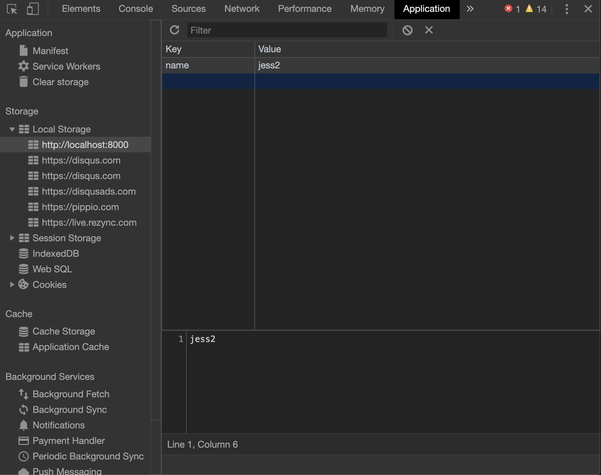

### Storage
웹 개발을 하다보면 스토리지가 필요할 때가 있다. 스토리지에 대해 알아보자.

HTML5에서 추가된 Storage는 `Window` 객체의 하위 객체로,  
영구 저장인 `localStorage`와 브라우저 탭 별로 유효한 `sessionStorage`라는 두 가지 저장 방식을 제공한다.

### cookies vs localStorage vs sessionStorage

||cookies|localStorage|sessionStorage|
|---|---|---|---|
|Capacity|4kb|10mb|5mb|
|Browsers|HTML4, HTML5|HTML5|HTML5|
|Accessible from|Any Window|Any Window|Same tab|
|Expires|Manually set|Never|On tab close|
|Storage Location|Browser, Server|Browser|Browser|
|Sent with requests|O|X|X|

- 로컬 스토리지와 세션 스토리지는 유효 기간 외에는 사용하는 데 큰 차이가 없다.

### 스토리지 method 및 property
데이터를 저장하고 조회하기 위해 사용되는 메서드와 속성을 정리해 보고 예시를 살펴보자.  
스토리지는 `key`와 `value`의 형태로 이루어지며 `key`는 원하는 `value`를 가져오는 데 사용된다.

|method/property&nbsp;|기능|
|---|---|
|setItem(key, value)|해당 키 값으로 데이터를 저장한다.|
|getItem(key)|해당 키 값의 이름을 가진 데이터를 가져온다.|
|removeItem(key)|해당 키 값의 이름을 가진 데이터를 삭제한다.|
|key(index)|해당 인덱스 값을 가진 키의 이름을 가져온다.|
|clear()|모든 데이터를 삭제한다.|
|length|저장된 데이터 수를 가져온다.|

### 데이터 저장 및 조회
애플리케이션을 실행할 때 서버에 저장하지 않아도 되는 환경 설정을 로컬 스토리지에 저장하면 서버와의 통신할 필요가 없으므로 성능상으로도 이점이 있다.

```js
// key, value 쌍으로 저장
localStorage.setItem('name', 'jess2');

// key로 조회
let userName = localStorage.getItem('name'); 
console.log(userName); // jess2
```
- 로컬 스토리지에 `name`이라는 key 값으로 `jess2`라는 value를 저장한 다음 다시 저장한 key 값으로 데이터를 조회한다.

### 데이터 삭제
데이터 삭제도 다음과 같이 `removeItem()` 메서드로 간단하게 처리할 수 있다.
```js
localStorage.removeItem('name');
```

### 크롬 개발자 도구로 스토리지 확인하기
크롬 개발자 도구에서 Application 탭을 클릭하면 Storage > Local Storage 에서 저장한 데이터의 키와 값을 확인할 수 있다.


### Example
다음은 `textarea`의 글자색과 배경색을 **스토리지에 저장(`setItem`)하고 조회(`getItem`)**하는 예제이다.

```html
<textarea name="txt" id="txt" cols="30" rows="10"></textarea><br/>
<label for="textcolor">change text color</label>
<input type="color" id="textcolor"/><br/>
<label for="bgcolor">change bg color</label>
<input type="color" id="bgcolor"/><br/>

<button id="set_color">set color</button> <!--색상 설정 저장 버튼-->
<button id="get_color">get color</button> <!--색상 설정 읽기 버튼-->
```
```js
//글 상자에 글자를 입력
$('#txt').val('글상자 영역의 색상 값을 저장합니다.');

//글자색 변경 시 글상자의 글자색에 적용
$('#textcolor').change(function(){
  let color = $(this).val();
  $('#txt').css('color', color);
});

//배경색 변경시 글상자의 배경색에 적용
$('#bgcolor').change(function(){
  let color = $(this).val();
  $('#txt').css('backgroundColor', color);
});

//글자색과 배경색을 로컬 스토리지에 저장
$('#set_color').click(function(){
  let bgcolor = $('#bgcolor').val();
  let textcolor = $('#textcolor').val();
  let obj = {
    bgcolor : bgcolor,
    textcolor : textcolor
  }
  localStorage.setItem('color', JSON.stringify(obj));
});

//로컬 스토리지에 저장한 환경 설정을 조회
$('#get_color').click(function(){
  let color = JSON.parse(localStorage.getItem('color'));
  $('#txt').css({
    'backgroundColor' : color.bgcolor,
    'color' : color.textcolor
  });
});
```
1. color picker 입력 요소를 통해 색상이 변경되면 텍스트 영역의 색상이 변경되도록 한다.
2. 현재 컬러 입력 요소(글자색과 배경색)에 지정된 색상 값을 `val()`메서드로 읽어서 각각의 키 값(bgcolor, textcolor)을 지정해 로컬 스토리지에 저장한다.
3. 자바스크립트에서는 데이터를 외부(웹 스토리지나 서버 등)와 주고받는 경우 JSON 표준 형식을 이용한다. 데이터를 내보낼 경우에는 먼저 데이터를 문자열(string)로 변환해 주어야 한다. 따라서 객체 형태의 데이터를 스트링으로 변환하기 위해 `JSON.stringify()`메서드를 사용해 문자열로 변환시켜 저장한다.
4. 환경 설정으로 저장한 로컬 스토리지의 키 값으로 글상자 `#txt`의 색상 값을 읽어 와 다시 글상자에 스타일로 적용한다.
5. `JSON.parse()`를 이용해 문자열을 객체로 변환하여 가져온다. 이러한 형식은 자바스크립트 뿐만 아니라 독립적인 데이터 포맷(JSON)으로 다양한 프로그래밍 언어에서 표준(AJAX 통신)으로 사용된다.

### 실행결과
<iframe height="265" style="width: 100%;" scrolling="no" title="yEJRdO" src="https://codepen.io/je_ss2/embed/yEJRdO?height=265&theme-id=dark&default-tab=result" frameborder="no" allowtransparency="true" allowfullscreen="true">
  See the Pen <a href='https://codepen.io/je_ss2/pen/yEJRdO'>yEJRdO</a> by SoyeonJung
  (<a href='https://codepen.io/je_ss2'>@je_ss2</a>) on <a href='https://codepen.io'>CodePen</a>.
</iframe>

색상을 선택한 뒤 set color 버튼을 클릭하면 로컬스토리지에 선택한 색상이 저장된다.  
색상을 변경한 뒤에 get color 버튼을 클릭하면 로컬 스토리지에 저장되었던 색상을 읽어온다.

### Reference
- https://www.youtube.com/watch?v=AwicscsvGLg